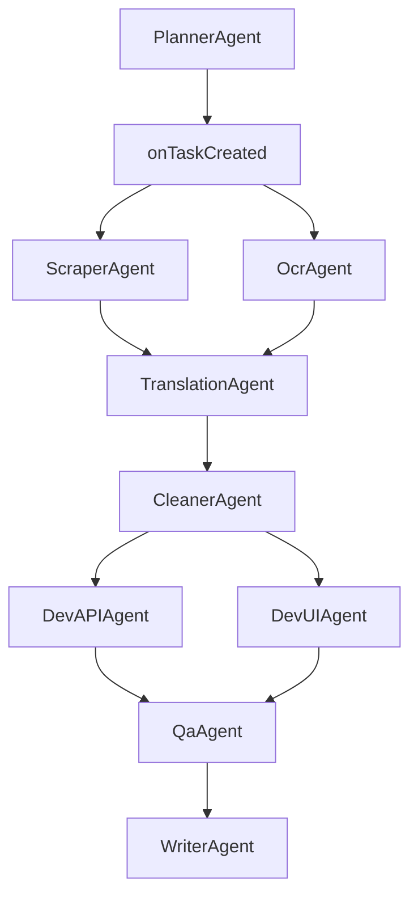

# CLAUDE.md - Personal Recipe Intelligence (PRI) 開発ルール完全版

本ドキュメントは **Personal Recipe Intelligence (PRI)** プロジェクトにおける ClaudeCode の利用方針・SubAgent 行動規範・MCP 設定・ファイル生成ルール・セキュリティ要件・開発フェーズを統合した **完全仕様ドキュメント** です。

ClaudeCode / SubAgents / Hooks はすべてこのルールを遵守すること。

---

## 0. プロジェクト概要

Personal Recipe Intelligence (PRI) は、個人向けの **料理レシピ収集・解析・管理システム**。

### コア機能
- Web レシピの URL から材料・手順を抽出（国内・海外サイト対応）
- OCR（画像）からレシピ化
- DeepL API による海外レシピの日本語化
- JSON 形式への構造化
- タグ管理・データ整理
- WebUI（軽量）で閲覧・検索
- ClaudeCode の SubAgents による自動開発

### 対応レシピ情報取得元
| カテゴリ | 取得元 |
|---------|--------|
| 国内サイト | クックパッド, クラシル, デリッシュキッチン, Nadia, 楽天レシピ 等 |
| 海外サイト | Allrecipes, BBC GoodFood, NYTimes Cooking, Serious Eats 等 |
| 動画 | YouTube, Instagram Reels, TikTok（説明欄・字幕抽出） |
| 画像 | 手書きレシピ, 雑誌, パッケージ裏面（OCR解析） |
| PDF | 公式レシピPDF, 電子書籍 |
| SNS | X（旧Twitter）, Instagram, Facebook |

### 対象環境
- **Ubuntu（GUIなし）＋ SSH 開発（Windows Terminal）**
- VSCode 不使用
- tmux 不使用

---

## 1. 全体方針（最重要）

- ClaudeCode は **SSH＋Ubuntu CLI** で動作する前提とする
- VSCode、tmux、GUI ツール前提の提案は禁止
- MCP は最小構成（Browser / Filesystem / Puppeteer のみ）
- **MCP 同時起動数は最大 1**（直列化必須）
- SubAgents はすべてこの CLAUDE.md のルールに基づき動作する
- 「軽量・高速・安全」な開発を最優先とする

---

## 2. 開発基盤・環境設定

### 2.1 言語・ランタイム
| 種別 | バージョン |
|------|-----------|
| Python | 3.11 |
| Node.js | 20 |
| Bun | 最新版（WebUI ビルド高速化） |

### 2.2 ディレクトリ構成（厳守）
```
personal-recipe-intelligence/
├── backend/           # Python API (FastAPI)
│   ├── api/           # エンドポイント
│   ├── models/        # SQLModel / Pydantic
│   ├── services/      # ビジネスロジック
│   ├── scraper/       # Web スクレイピング
│   ├── ocr/           # OCR 処理
│   ├── translation/   # DeepL 翻訳
│   └── tests/         # pytest
├── frontend/          # WebUI (Svelte)
│   ├── src/           # コンポーネント
│   └── tests/         # bun test
├── src/               # 共通コード
├── config/            # 設定ファイル
├── data/              # SQLite / JSON 保存
│   ├── db/            # SQLite データベース
│   ├── images/        # レシピ画像
│   ├── json-schema/   # JSON スキーマ
│   └── backups/       # バックアップ
├── logs/              # ログ
├── docs/              # ドキュメント
│   ├── 01_プロジェクト概要(project-overview)/
│   ├── 02_設計書(design)/
│   ├── 03_API仕様書(api-specification)/
│   ├── 04_データベース(database)/
│   ├── 05_フロントエンド(frontend)/
│   ├── 06_バックエンド(backend)/
│   ├── 07_テスト(testing)/
│   ├── 08_セキュリティ(security)/
│   ├── 09_運用(operations)/
│   ├── 10_ClaudeCode設定(claudecode)/
│   ├── implementation/    # 実装サマリー
│   ├── performance/       # パフォーマンス関連
│   ├── testing/           # テスト関連
│   ├── quickstart/        # クイックスタート
│   ├── features/          # 機能README
│   └── archive/           # アーカイブ
├── tests/             # 統合テスト
├── scripts/           # 自動化スクリプト
│   ├── setup/         # セットアップ系
│   ├── analysis/      # 分析系
│   ├── testing/       # テスト実行系
│   └── utils/         # ユーティリティ
├── .claude/           # ClaudeCode 設定
│   ├── agents/        # SubAgent JSON
│   └── hooks/         # Hooks JS
├── .env.example       # 環境変数テンプレート
├── CLAUDE.md          # 本ファイル
├── README.md          # プロジェクト説明
├── CHANGELOG.md       # 変更履歴
├── dev.sh             # 開発サーバー起動
├── lint.sh            # Lint チェック
└── test.sh            # テスト実行
```

### 2.3 環境変数管理
- `.env` を使用（`.env.example` 必須）
- シークレットのハードコード禁止
- `.env` は version control に含めない

### 2.4 依存管理
- Python は `requirements.txt` + `pip freeze` で固定
- Node は `bun.lockb` を commit
- 自動アップデート禁止（手動レビュー必須）

---

## 3. コードスタイル

### 3.1 フォーマッター
| 言語 | ツール |
|------|--------|
| Python | Black |
| JavaScript | Prettier |

### 3.2 リンター
| 言語 | ツール |
|------|--------|
| Python | Ruff |
| JavaScript | ESLint |

### 3.3 命名規則
| 対象 | 規則 |
|------|------|
| ファイル | kebab-case |
| Python 変数 | snake_case |
| JS 変数 | camelCase |
| クラス名 | PascalCase |

### 3.4 その他
- インデント: **2スペース**
- コメント: docstring / JSDoc
- インポート順序: 標準ライブラリ → 外部パッケージ → ローカルモジュール
- 最大行長: **120文字**
- 型アノテーション: Python 必須 / JS 任意（TS 推奨）

---

## 4. テスト規約

### 4.1 フレームワーク
| 言語 | ツール |
|------|--------|
| Python | pytest |
| JavaScript | bun test |

### 4.2 配置
```
tests/              # 統合テスト
backend/tests/      # API テスト
frontend/tests/     # UI テスト
```

### 4.3 命名規則
- Python: `test_*.py`
- JS: `*.test.js`

### 4.4 カバレッジ
- 最低 **60%** を維持

### 4.5 モック
- DB, Web 取得, OCR など外部依存は必ずモック化

---

## 5. セキュリティ

### 5.1 認証
- API Key または Bearer Token

### 5.2 入力検証
- API はすべて Pydantic でバリデーション

### 5.3 機密データ
- ログに機密データを出力しない
- トークンは必ず **マスク**

### 5.4 脆弱性管理
- 依存関係スキャンを定期実施

### 5.5 暗号化
- HTTPS 前提（開発時 localhost は例外）

---

## 6. エラーハンドリング・ログ

### 6.1 例外処理
- 例外は message + trace + context を含む

### 6.2 ログ形式
- JSON 形式推奨
- タイムスタンプは ISO8601

### 6.3 マスキング
- password, token, api_key の露出禁止

### 6.4 監査
- 料理データの更新・削除は監査ログに記録

---

## 7. Git 運用

### 7.1 ブランチ戦略
| ブランチ | 用途 |
|---------|------|
| main | 安定版 |
| develop | 開発統合 |
| feature/* | 機能開発 |
| fix/* | バグ修正 |
| docs/* | ドキュメント |

### 7.2 コミット規約
- **Conventional Commits** を使用
  - `feat(api): add recipe parser`
  - `fix(scraper): correct puppeteer error`
  - `docs: update README`

### 7.3 .gitignore 必須項目
- `.env`
- `data/`
- `logs/`
- `node_modules/`
- `__pycache__/`
- `.venv/`

---

## 8. ドキュメント

### 8.1 README 必須内容
- セットアップ手順
- ディレクトリ構成
- API 使用方法
- WebUI 起動方法

### 8.2 CHANGELOG
- SemVer で更新管理

### 8.3 アーキテクチャ
- ADR 必要時のみ作成
- ER 図は `docs/` に保存

---

## 9. 自動化（CLI 専用）

### 9.1 スクリプト
| ファイル | 用途 |
|----------|------|
| scripts/setup.sh | 依存インストール |
| scripts/dev.sh | API & UI 同時起動 |
| scripts/lint.sh | lint チェック |
| scripts/test.sh | 全テスト |

### 9.2 品質ゲート
- lint + test が通過しなければマージ禁止

---

## 10. データベース

### 10.1 DB
- SQLite（個人用途のため）

### 10.2 マイグレーション
- Alembic を使用

### 10.3 命名
- テーブル名 / カラム名は snake_case

### 10.4 バックアップ
- `data/backups/` に保存

### 10.5 主要テーブル
| テーブル | 説明 |
|----------|------|
| recipes | レシピ基本情報 |
| ingredients | 材料（正規化済み） |
| steps | 調理手順 |
| tags | タグ管理 |
| sources | 取得元情報 |

---

## 11. API 設計

### 11.1 スタイル
- REST

### 11.2 ルーティング
- `/api/v1/recipes/...`

### 11.3 レスポンス形式
```json
{
  "status": "ok",
  "data": {},
  "error": null
}
```

### 11.4 レート制限
- 個人用途のため不要

---

## 12. パフォーマンス

### 12.1 目標
- API レスポンス：200ms 以下

### 12.2 キャッシュ
- 軽量キャッシュのみ利用

### 12.3 非同期
- 必要時に async 化

---

## 13. アクセシビリティ・国際化

- 文字コード: UTF-8
- タイムゾーン: Asia/Tokyo
- 表示文言は UI コンポーネントに集約

---

## 14. ClaudeCode 固有設定（最重要）

### 14.1 自律性レベル
- **medium**（破壊的操作を回避）

### 14.2 許可コマンド
```
ls, cat, mkdir, touch, rm（安全範囲）, python3, bun, node, curl, wget
```

### 14.3 禁止コマンド
```
rm -rf, systemctl, reboot, shutdown, killall
```

### 14.4 編集可能ディレクトリ
```
backend/, frontend/, config/, src/, docs/, tests/, scripts/, .claude/
```

### 14.5 禁止領域
```
/etc/*, /var/*, /boot/*, /root/*, $HOME直下
```

### 14.6 MCP 設定
| MCP | 許可 | 同時起動数 |
|-----|------|-----------|
| Browser | 許可 | 1 |
| Puppeteer | 許可 | 1 |
| Filesystem | 許可 | 1 |

**重要**: Browser MCP と Puppeteer MCP の同時起動は禁止

---

## 15. SubAgents 構成（9種）

### 15.1 エージェント一覧
| Agent | 役割 | MCP使用 |
|-------|------|---------|
| PlannerAgent | タスク分解・割当 | なし |
| DevAPIAgent | FastAPI コード生成 | なし |
| DevUIAgent | Svelte UI 生成 | なし |
| ScraperAgent | Web レシピ抽出 | Browser/Puppeteer |
| OcrAgent | 画像テキスト抽出 | Filesystem |
| TranslationAgent | DeepL 翻訳 | なし |
| CleanerAgent | データ正規化 | なし |
| QaAgent | テスト自動生成 | なし |
| WriterAgent | ドキュメント生成 | なし |

### 15.2 連携フロー


---

## 16. Hooks 構成

### 16.1 Hook 一覧
| Hook | トリガー | 役割 |
|------|----------|------|
| onTaskCreated | タスク生成時 | SubAgent への自動振り分け |
| onFileChanged | ファイル変更時 | 関連 SubAgent への通知 |
| onAgentResult | Agent 完了時 | 次 Agent への連鎖 |
| onMcpEvent | MCP イベント時 | MCP 状態管理 |

### 16.2 MCP Manager
```javascript
// mcpManager.js の必須メソッド
acquireMCP(type)   // MCP 取得（待機キュー付き）
releaseMCP(type)   // MCP 解放
isMcpBusy()        // 稼働状況確認
queueTask(task)    // 待機キューに格納
nextTask()         // キュー実行
```

---

## 17. PRI プロジェクト特有のルール

### 17.1 レシピ解析
- 材料は必ず正規化（例：玉ねぎ → たまねぎ 統一）
- 分量は JSON 化し、数値変換できる形式を使う
- 手順は配列で構造化

### 17.2 海外レシピの分量変換
| 英語表記 | 日本語換算 |
|----------|------------|
| 1 cup | 240 ml |
| 1 tbsp | 15 ml (大さじ1) |
| 1 tsp | 5 ml (小さじ1) |

### 17.3 Web スクレイピング
- Browser MCP / Puppeteer MCP の **同時起動禁止**
- レシピ抽出は DOM 構造に応じて柔軟にパターン化

### 17.4 OCR
- 画像は Filesystem MCP に保存して処理

### 17.5 WebUI
- 直感的・高速・軽量を優先する
- JS フレームワーク: **Svelte**（軽量・高速）

---

## 18. コンプライアンス

- 使用ライセンスは MIT / Apache2 / BSD
- GPL 系は許可不要（個人プロジェクトのため制限）
- 開発ログは logs/ に保存

---

## 19. 最終規定

- ClaudeCode は常に本 CLAUDE.md に従うこと
- 逸脱する場合は必ず理由と代案を提示する
- 開発効率・安定動作・安全性を最優先とする
