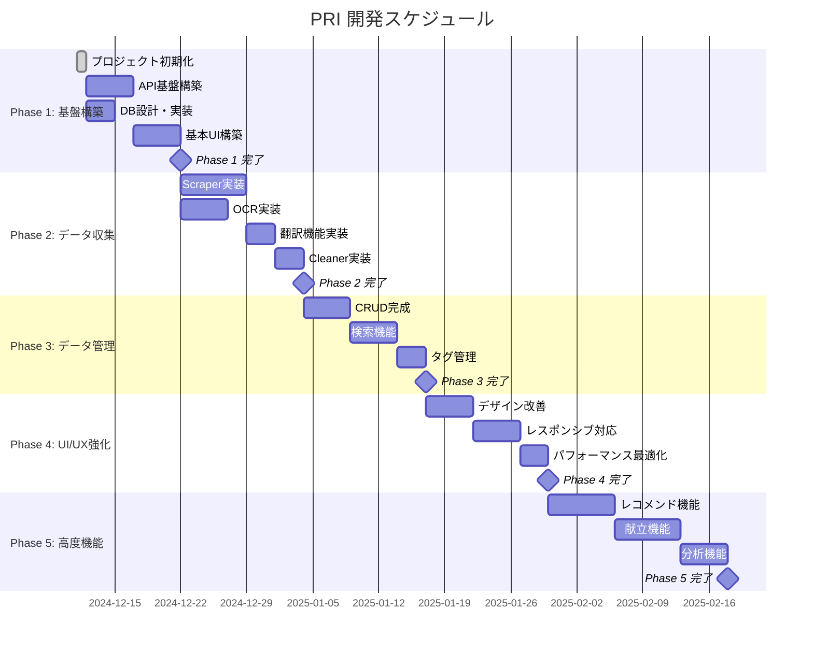

# スケジュール (Schedule)

## 1. 概要

本ドキュメントは、Personal Recipe Intelligence (PRI) プロジェクトの開発スケジュールを定義する。

## 2. マイルストーン

## 3. フェーズ別詳細

### Phase 1: 基盤構築

| タスク | 説明 | 成果物 |
|--------|------|--------|
| プロジェクト初期化 | ディレクトリ構造、設定ファイル | 基本構造 |
| API基盤構築 | FastAPI設定、ルーティング | /api/v1/* |
| DB設計・実装 | SQLModel、マイグレーション | schemas |
| 基本UI構築 | Svelte初期設定、基本画面 | WebUI |

**完了条件**
- [x] プロジェクト構造作成済み
- [ ] FastAPI起動確認
- [ ] DBマイグレーション完了
- [ ] トップページ表示

### Phase 2: データ収集

| タスク | 説明 | 成果物 |
|--------|------|--------|
| Scraper実装 | 国内・海外サイト対応 | ScraperAgent |
| OCR実装 | 画像テキスト抽出 | OcrAgent |
| 翻訳機能実装 | DeepL API連携 | TranslationAgent |
| Cleaner実装 | データ正規化 | CleanerAgent |

**完了条件**
- [ ] URL入力でレシピ取得
- [ ] 画像からテキスト抽出
- [ ] 英語レシピの日本語化
- [ ] 材料名の正規化

### Phase 3: データ管理

| タスク | 説明 | 成果物 |
|--------|------|--------|
| CRUD完成 | 全操作の実装 | API完成 |
| 検索機能 | 全文検索、フィルタ | 検索UI |
| タグ管理 | タグCRUD、自動付与 | タグ機能 |

**完了条件**
- [ ] レシピの追加・編集・削除
- [ ] キーワード検索
- [ ] タグによるフィルタリング

### Phase 4: UI/UX強化

| タスク | 説明 | 成果物 |
|--------|------|--------|
| デザイン改善 | コンポーネント整備 | 統一UI |
| レスポンシブ対応 | モバイル最適化 | モバイルUI |
| パフォーマンス最適化 | 速度改善 | 高速化 |

**完了条件**
- [ ] 統一されたデザイン
- [ ] スマートフォン対応
- [ ] 読み込み3秒以内

### Phase 5: 高度機能

| タスク | 説明 | 成果物 |
|--------|------|--------|
| レコメンド機能 | 類似レシピ提案 | レコメンドUI |
| 献立機能 | 週間献立生成 | 献立UI |
| 分析機能 | 統計・傾向分析 | ダッシュボード |

**完了条件**
- [ ] 関連レシピ表示
- [ ] 献立自動生成
- [ ] 利用統計表示

## 4. 週次スケジュール（Phase 1例）

| 日 | 午前 | 午後 |
|----|------|------|
| Day 1 | プロジェクト初期化 | CLAUDE.md作成 |
| Day 2 | FastAPI設定 | ルーティング実装 |
| Day 3 | SQLModel定義 | マイグレーション |
| Day 4 | CRUD API実装 | テスト作成 |
| Day 5 | Svelte設定 | 基本コンポーネント |
| Day 6 | UI実装 | API連携 |
| Day 7 | 統合テスト | Phase 1レビュー |

## 5. リスクと対策

| リスク | 影響 | 対策 |
|--------|------|------|
| 遅延 | スケジュール変更 | バッファ確保 |
| 技術的問題 | 開発停滞 | 代替案の検討 |
| 外部API障害 | 機能制限 | モック対応 |

## 6. 進捗管理

### 6.1 進捗確認方法
- TodoWrite による日次管理
- Git commit による変更追跡
- CHANGELOG による履歴管理

### 6.2 報告頻度
- 日次: TodoWrite更新
- フェーズ完了時: CHANGELOG更新
- 問題発生時: GitHub Issues

## 7. 改訂履歴

| 日付 | バージョン | 変更内容 |
|------|-----------|----------|
| 2024-12-11 | 1.0.0 | 初版作成 |
