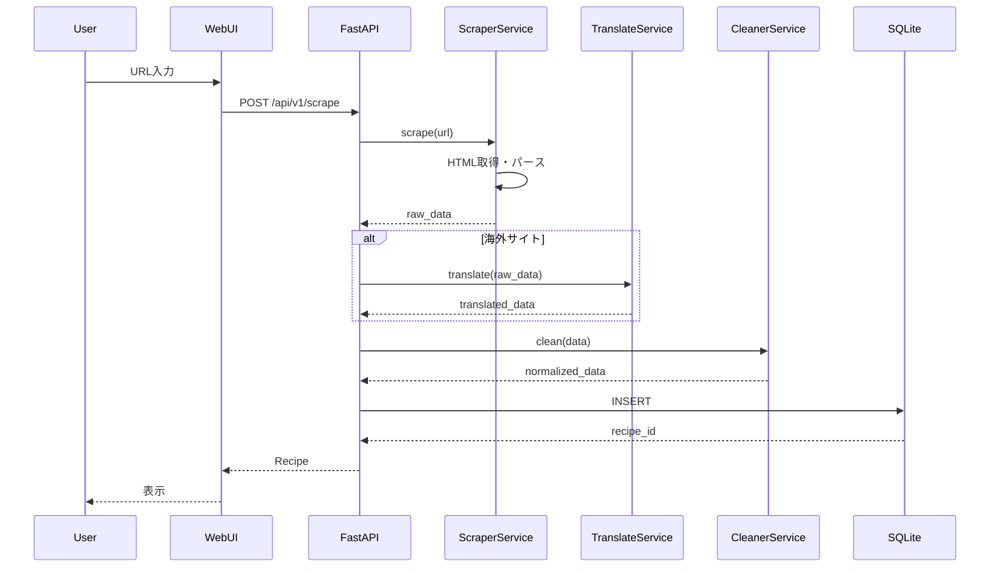
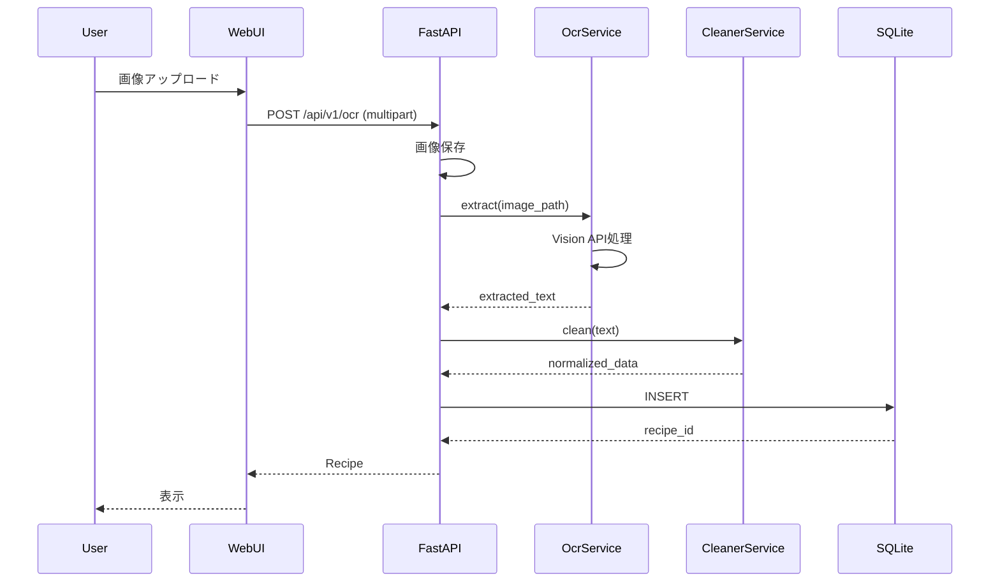

# システムアーキテクチャ (System Architecture)

## 1. 概要

本ドキュメントは、Personal Recipe Intelligence (PRI) のシステム全体のアーキテクチャを定義する。

## 2. アーキテクチャ概要図

```
┌─────────────────────────────────────────────────────────────────────┐
│                           User Layer                                │
│  ┌───────────────────────────────────────────────────────────────┐  │
│  │                      Web Browser                              │  │
│  │                   (Chrome/Firefox/Edge)                       │  │
│  └───────────────────────────────────────────────────────────────┘  │
└─────────────────────────────────────────────────────────────────────┘
                                    │
                                    ▼
┌─────────────────────────────────────────────────────────────────────┐
│                        Presentation Layer                           │
│  ┌───────────────────────────────────────────────────────────────┐  │
│  │                     Svelte WebUI                              │  │
│  │  ┌─────────┐ ┌─────────┐ ┌─────────┐ ┌─────────┐            │  │
│  │  │  Pages  │ │Component│ │ Stores  │ │   Lib   │            │  │
│  │  └─────────┘ └─────────┘ └─────────┘ └─────────┘            │  │
│  └───────────────────────────────────────────────────────────────┘  │
└─────────────────────────────────────────────────────────────────────┘
                                    │ HTTP/JSON
                                    ▼
┌─────────────────────────────────────────────────────────────────────┐
│                          API Layer                                  │
│  ┌───────────────────────────────────────────────────────────────┐  │
│  │                      FastAPI Server                           │  │
│  │  ┌─────────┐ ┌─────────┐ ┌─────────┐ ┌─────────┐            │  │
│  │  │ Routes  │ │ Schemas │ │  Deps   │ │Middleware│           │  │
│  │  └─────────┘ └─────────┘ └─────────┘ └─────────┘            │  │
│  └───────────────────────────────────────────────────────────────┘  │
└─────────────────────────────────────────────────────────────────────┘
                                    │
                                    ▼
┌─────────────────────────────────────────────────────────────────────┐
│                        Business Layer                               │
│  ┌─────────┐ ┌─────────┐ ┌─────────┐ ┌─────────┐ ┌─────────┐      │
│  │ Recipe  │ │ Scraper │ │   OCR   │ │Translate│ │ Cleaner │      │
│  │ Service │ │ Service │ │ Service │ │ Service │ │ Service │      │
│  └─────────┘ └─────────┘ └─────────┘ └─────────┘ └─────────┘      │
└─────────────────────────────────────────────────────────────────────┘
                                    │
                                    ▼
┌─────────────────────────────────────────────────────────────────────┐
│                          Data Layer                                 │
│  ┌───────────────────────────────────────────────────────────────┐  │
│  │                       SQLModel ORM                            │  │
│  │  ┌─────────┐ ┌─────────┐ ┌─────────┐ ┌─────────┐            │  │
│  │  │ Recipe  │ │Ingredient│ │  Step   │ │   Tag   │            │  │
│  │  └─────────┘ └─────────┘ └─────────┘ └─────────┘            │  │
│  └───────────────────────────────────────────────────────────────┘  │
│  ┌───────────────────────────────────────────────────────────────┐  │
│  │                      SQLite Database                          │  │
│  └───────────────────────────────────────────────────────────────┘  │
└─────────────────────────────────────────────────────────────────────┘
                                    │
                                    ▼
┌─────────────────────────────────────────────────────────────────────┐
│                       External Services                             │
│  ┌─────────┐ ┌─────────┐ ┌─────────┐                              │
│  │ DeepL   │ │ Recipe  │ │  File   │                              │
│  │   API   │ │  Sites  │ │ System  │                              │
│  └─────────┘ └─────────┘ └─────────┘                              │
└─────────────────────────────────────────────────────────────────────┘
```

## 3. レイヤー詳細

### 3.1 User Layer

**役割**: ユーザーインターフェースへのアクセス

**コンポーネント**
- Webブラウザ（Chrome, Firefox, Edge）

**特徴**
- レスポンシブデザイン対応
- JavaScript有効が必須

### 3.2 Presentation Layer

**役割**: ユーザーインターフェースの提供

**コンポーネント**
| コンポーネント | 説明 |
|----------------|------|
| Pages | ページコンポーネント |
| Components | 再利用可能なUIコンポーネント |
| Stores | 状態管理 |
| Lib | ユーティリティ、API通信 |

**技術**
- Svelte 4.x
- Vite 5.x
- Bun

### 3.3 API Layer

**役割**: RESTful APIの提供

**コンポーネント**
| コンポーネント | 説明 |
|----------------|------|
| Routes | エンドポイント定義 |
| Schemas | リクエスト/レスポンススキーマ |
| Dependencies | 依存性注入 |
| Middleware | CORS、認証等 |

**技術**
- FastAPI 0.104+
- Pydantic 2.x
- Uvicorn

### 3.4 Business Layer

**役割**: ビジネスロジックの実装

**サービス**
| サービス | 責任 |
|----------|------|
| RecipeService | レシピCRUD操作 |
| ScraperService | Webスクレイピング |
| OcrService | 画像テキスト抽出 |
| TranslateService | 翻訳処理 |
| CleanerService | データ正規化 |

### 3.5 Data Layer

**役割**: データ永続化

**コンポーネント**
| コンポーネント | 説明 |
|----------------|------|
| SQLModel | ORMモデル |
| SQLite | データベース |
| Alembic | マイグレーション |

## 4. データフロー

### 4.1 レシピ取得フロー（Webスクレイピング）



### 4.2 レシピ取得フロー（OCR）



## 5. 非機能要件

### 5.1 パフォーマンス

| 項目 | 目標値 |
|------|--------|
| API応答時間 | 200ms以下 |
| ページ読み込み | 3秒以下 |
| 同時接続数 | 1（個人利用） |

### 5.2 可用性

| 項目 | 目標値 |
|------|--------|
| 稼働率 | 99%（ローカル環境） |
| データバックアップ | 日次 |

### 5.3 セキュリティ

| 項目 | 対策 |
|------|------|
| 入力検証 | Pydanticバリデーション |
| SQLインジェクション | ORM使用 |
| XSS | 適切なエスケープ |

## 6. 技術選定理由

### 6.1 FastAPI

**選定理由**
- 高速なパフォーマンス
- 自動OpenAPI生成
- 型ヒントサポート
- 非同期処理対応

### 6.2 Svelte

**選定理由**
- 軽量なバンドルサイズ
- 高速なランタイム
- シンプルな構文
- 少ない定型コード

### 6.3 SQLite

**選定理由**
- サーバーレス
- ゼロ設定
- 個人利用に十分
- ポータビリティ

## 7. 制約事項

### 7.1 環境制約
- Ubuntu CLI環境のみ
- VSCode/tmux不使用
- GUI不使用

### 7.2 技術制約
- MCP同時起動は最大1
- Python 3.11固定
- Node.js 20固定

## 8. 改訂履歴

| 日付 | バージョン | 変更内容 |
|------|-----------|----------|
| 2024-12-11 | 1.0.0 | 初版作成 |
