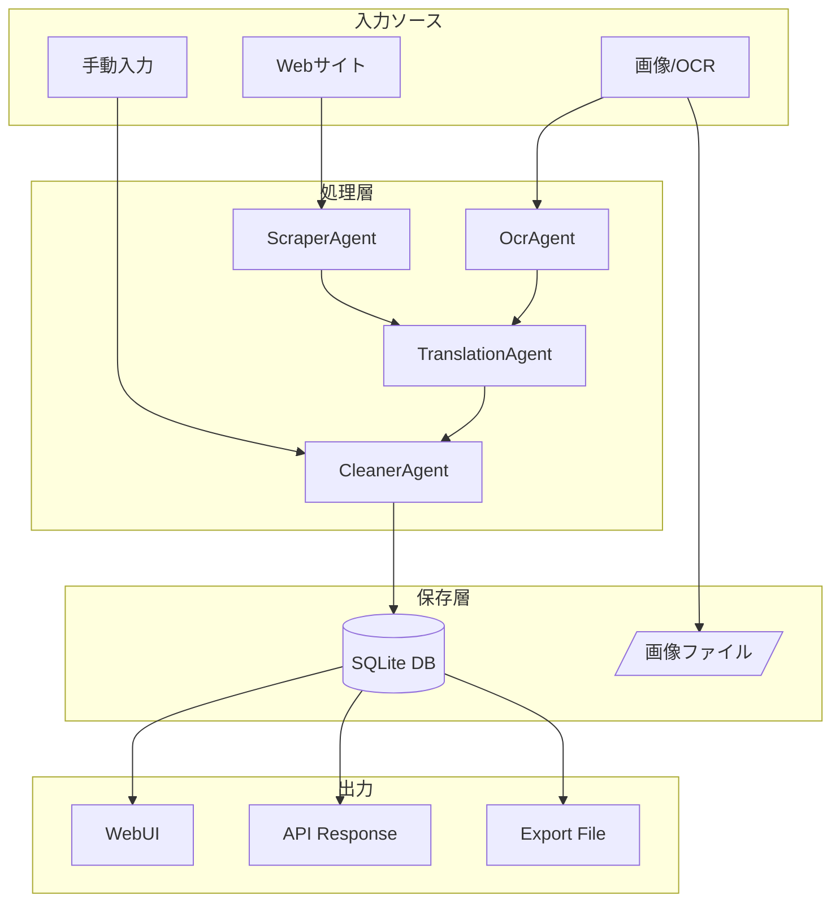
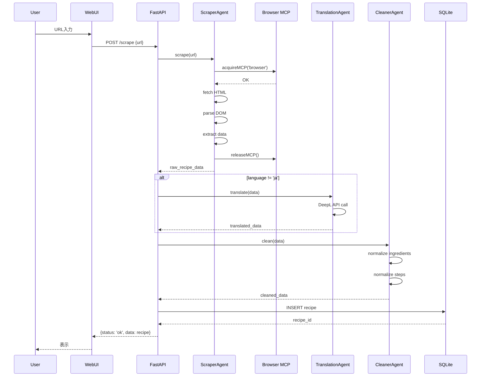
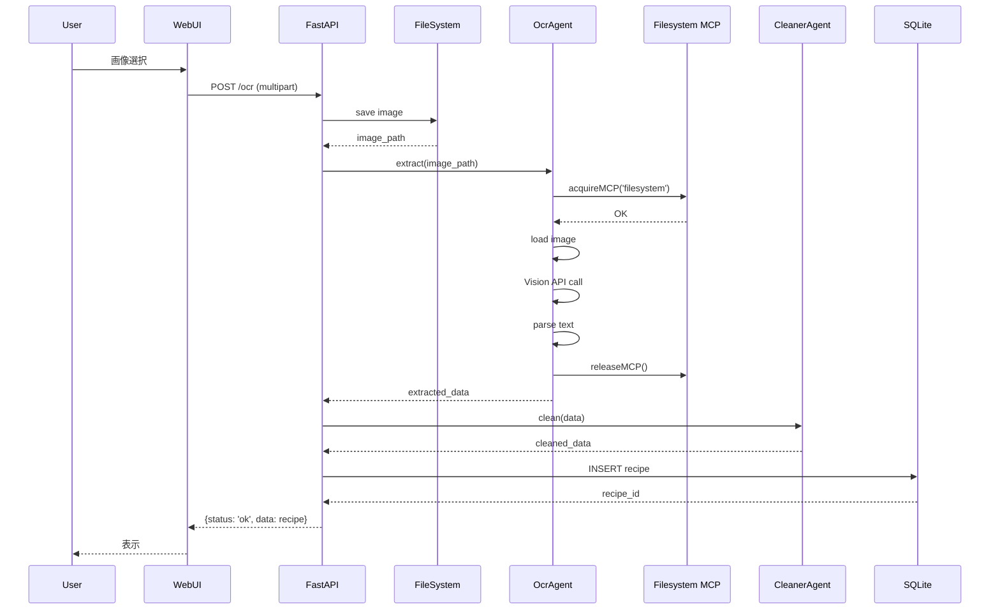
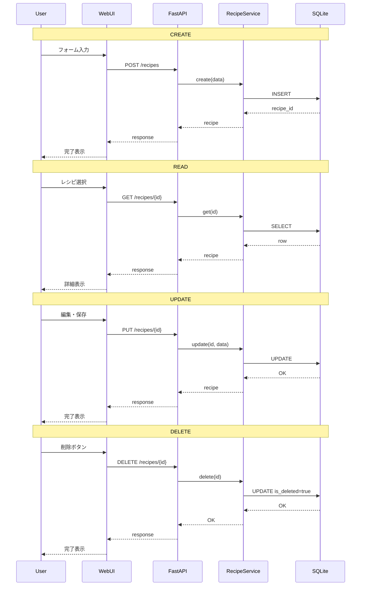
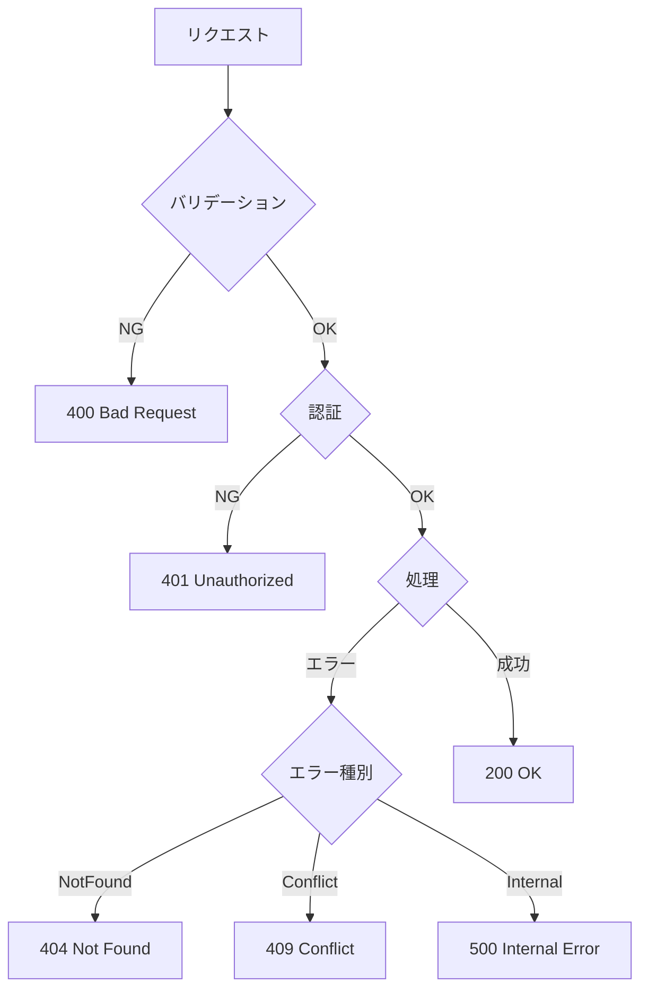
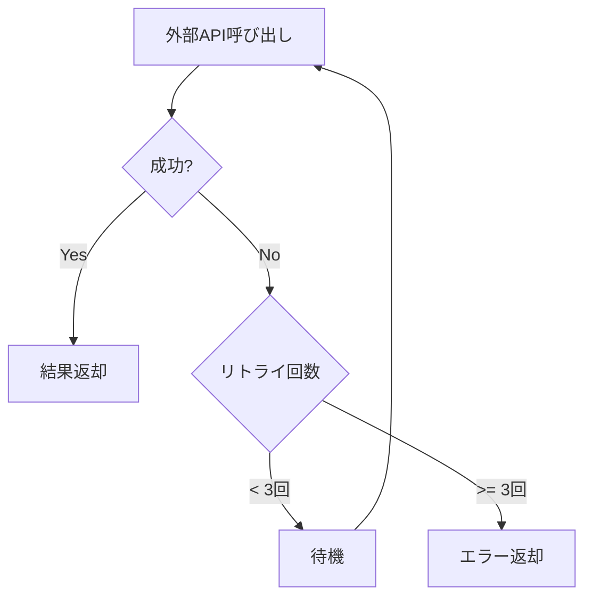
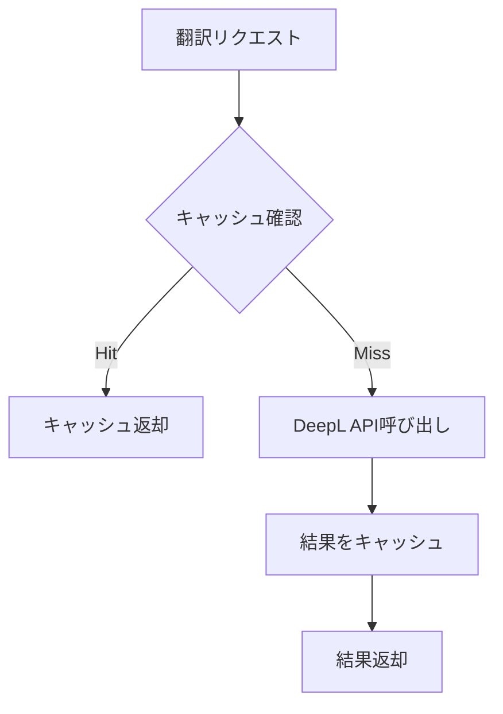
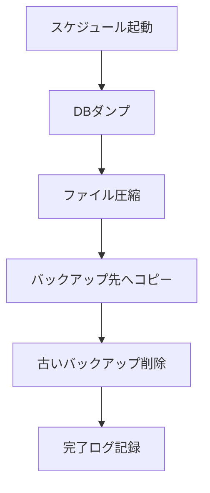

# データフロー設計 (Data Flow Design)

## 1. 概要

本ドキュメントは、Personal Recipe Intelligence (PRI) におけるデータの流れを定義する。

## 2. 全体データフロー



## 3. 詳細データフロー

### 3.1 Webスクレイピングフロー



### 3.2 OCRフロー



### 3.3 CRUD操作フロー



## 4. データ変換

### 4.1 スクレイピングデータ変換

```
[HTML] --> [Raw Data] --> [Translated] --> [Normalized] --> [DB Record]

例:
HTML:
<h1>Chicken Curry</h1>
<li>2 cups rice</li>

Raw Data:
{
  "title": "Chicken Curry",
  "ingredients": ["2 cups rice"]
}

Translated:
{
  "title": "チキンカレー",
  "ingredients": ["2カップ ご飯"]
}

Normalized:
{
  "title": "チキンカレー",
  "ingredients": [
    {
      "name": "ご飯",
      "name_normalized": "ごはん",
      "amount": 480,
      "unit": "ml"
    }
  ]
}
```

### 4.2 OCRデータ変換

```
[Image] --> [Raw Text] --> [Structured] --> [Normalized] --> [DB Record]

例:
Raw Text:
"カレーライス
材料（2人分）
玉ねぎ 1個
にんじん 1/2本
..."

Structured:
{
  "title": "カレーライス",
  "servings": 2,
  "ingredients": [
    "玉ねぎ 1個",
    "にんじん 1/2本"
  ]
}

Normalized:
{
  "title": "カレーライス",
  "servings": 2,
  "ingredients": [
    {"name": "たまねぎ", "amount": 1, "unit": "個"},
    {"name": "にんじん", "amount": 0.5, "unit": "本"}
  ]
}
```

## 5. エラーハンドリング

### 5.1 エラーフロー



### 5.2 リトライフロー



## 6. キャッシュフロー

### 6.1 翻訳キャッシュ



### 6.2 キャッシュ戦略

| データ種別 | TTL | 保存先 |
|-----------|-----|--------|
| 翻訳結果 | 30日 | SQLite |
| サイト構造 | 7日 | メモリ |
| 検索結果 | 5分 | メモリ |

## 7. バッチ処理フロー

### 7.1 日次バックアップ



## 8. 改訂履歴

| 日付 | バージョン | 変更内容 |
|------|-----------|----------|
| 2024-12-11 | 1.0.0 | 初版作成 |
