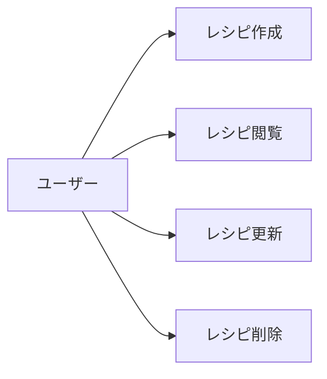
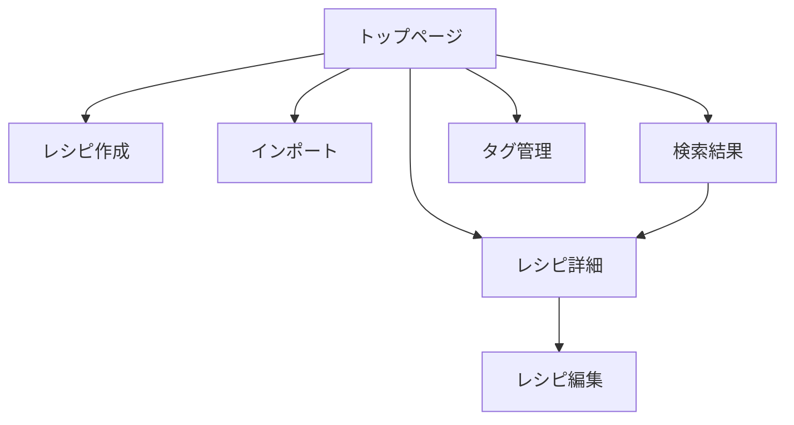

# 機能設計書 (Functional Design)

## 1. 概要

本ドキュメントは、Personal Recipe Intelligence (PRI) の各機能の詳細設計を定義する。

## 2. 機能一覧

| 機能ID | 機能名 | 優先度 | Phase |
|--------|--------|--------|-------|
| F-001 | レシピCRUD | 高 | 1 |
| F-002 | Webスクレイピング | 高 | 2 |
| F-003 | OCR | 高 | 2 |
| F-004 | 自動翻訳 | 高 | 2 |
| F-005 | データ正規化 | 高 | 2 |
| F-006 | 検索・フィルタ | 中 | 3 |
| F-007 | タグ管理 | 中 | 3 |
| F-008 | インポート/エクスポート | 低 | 3 |
| F-009 | レコメンド | 低 | 5 |
| F-010 | 献立生成 | 低 | 5 |

## 3. 機能詳細

### F-001: レシピCRUD

#### 3.1.1 概要
レシピの作成・読取・更新・削除機能

#### 3.1.2 ユースケース



#### 3.1.3 機能仕様

| 操作 | エンドポイント | 説明 |
|------|----------------|------|
| 作成 | POST /api/v1/recipes | 新規レシピ追加 |
| 一覧 | GET /api/v1/recipes | レシピ一覧取得 |
| 詳細 | GET /api/v1/recipes/{id} | 特定レシピ取得 |
| 更新 | PUT /api/v1/recipes/{id} | レシピ更新 |
| 削除 | DELETE /api/v1/recipes/{id} | レシピ削除（論理削除） |

#### 3.1.4 入力項目

| 項目 | 必須 | 型 | 制約 |
|------|------|-----|------|
| title | ○ | string | 1-200文字 |
| description | - | string | 最大2000文字 |
| servings | - | int | 1-100 |
| prep_time_minutes | - | int | 0-1440 |
| cook_time_minutes | - | int | 0-1440 |
| ingredients | ○ | array | 1件以上 |
| steps | ○ | array | 1件以上 |
| tags | - | array | 任意 |

---

### F-002: Webスクレイピング

#### 3.2.1 概要
URLからレシピ情報を自動抽出

#### 3.2.2 対応サイト

**国内サイト**
| サイト | URLパターン | 優先度 |
|--------|-------------|--------|
| クックパッド | cookpad.com | 高 |
| クラシル | kurashiru.com | 高 |
| Nadia | oceans-nadia.com | 中 |
| デリッシュキッチン | delishkitchen.tv | 中 |

**海外サイト**
| サイト | URLパターン | 優先度 |
|--------|-------------|--------|
| Allrecipes | allrecipes.com | 高 |
| BBC Good Food | bbcgoodfood.com | 中 |

#### 3.2.3 抽出項目

| 項目 | 抽出方法 |
|------|----------|
| タイトル | h1, og:title |
| 説明 | meta description |
| 材料 | 構造化データ, DOM |
| 手順 | 構造化データ, DOM |
| 画像 | og:image |

#### 3.2.4 処理フロー

```
1. URL入力
2. robots.txt確認
3. HTML取得
4. 構造化データ抽出試行
5. DOM解析によるフォールバック
6. データ正規化
7. DB保存
```

---

### F-003: OCR

#### 3.3.1 概要
画像からレシピテキストを抽出

#### 3.3.2 対応画像形式

| 形式 | 拡張子 | 対応 |
|------|--------|------|
| JPEG | .jpg, .jpeg | ○ |
| PNG | .png | ○ |
| WebP | .webp | ○ |
| HEIC | .heic | △ |

#### 3.3.3 対応ソース

| ソース | 認識難易度 |
|--------|-----------|
| 印刷レシピ | 低 |
| 手書きレシピ | 高 |
| パッケージ裏面 | 中 |
| スクリーンショット | 低 |

#### 3.3.4 処理フロー

```
1. 画像アップロード
2. 画像前処理（必要に応じて）
3. Claude Vision API呼び出し
4. テキスト抽出
5. 構造化解析
6. データ正規化
7. DB保存
```

---

### F-004: 自動翻訳

#### 3.4.1 概要
海外レシピを日本語に自動翻訳

#### 3.4.2 翻訳対象

| 項目 | 翻訳 |
|------|------|
| タイトル | ○ |
| 説明 | ○ |
| 材料名 | ○ |
| 手順 | ○ |
| 分量（単位） | 変換 |

#### 3.4.3 単位変換

| 英語 | 日本語 | 換算 |
|------|--------|------|
| cup | カップ | 240ml |
| tbsp | 大さじ | 15ml |
| tsp | 小さじ | 5ml |
| oz | オンス | 28.35g |
| lb | ポンド | 453.6g |

#### 3.4.4 処理フロー

```
1. 言語判定
2. 翻訳対象抽出
3. DeepL API呼び出し
4. 単位変換
5. 結果マージ
```

---

### F-005: データ正規化

#### 3.5.1 概要
レシピデータの統一・標準化

#### 3.5.2 正規化ルール

**材料名正規化**
| 入力例 | 正規化後 |
|--------|----------|
| 玉ねぎ | たまねぎ |
| 玉葱 | たまねぎ |
| タマネギ | たまねぎ |
| 人参 | にんじん |
| ニンジン | にんじん |

**分量正規化**
| 入力例 | 正規化後 |
|--------|----------|
| 大さじ1 | {"amount": 1, "unit": "tbsp"} |
| 1/2カップ | {"amount": 0.5, "unit": "cup"} |
| 少々 | {"amount": null, "unit": "pinch"} |

---

### F-006: 検索・フィルタ

#### 3.6.1 概要
レシピの検索とフィルタリング

#### 3.6.2 検索種別

| 種別 | 説明 |
|------|------|
| キーワード検索 | タイトル・説明の全文検索 |
| 材料検索 | 材料名での検索 |
| タグ検索 | タグでのフィルタ |
| 複合検索 | 上記の組み合わせ |

#### 3.6.3 ソート

| ソート項目 | 説明 |
|-----------|------|
| 作成日時 | 新しい順/古い順 |
| 更新日時 | 新しい順/古い順 |
| タイトル | あいうえお順 |
| 調理時間 | 短い順/長い順 |

---

### F-007: タグ管理

#### 3.7.1 概要
レシピへのタグ付けと管理

#### 3.7.2 タグカテゴリ

| カテゴリ | 例 |
|----------|-----|
| 料理ジャンル | 和食, 洋食, 中華 |
| 食材 | 肉料理, 魚料理, 野菜 |
| 難易度 | 簡単, 普通, 本格 |
| 季節 | 春, 夏, 秋, 冬 |
| イベント | お正月, クリスマス |

#### 3.7.3 機能

| 機能 | 説明 |
|------|------|
| タグ作成 | 新規タグ追加 |
| タグ付与 | レシピへタグ付け |
| タグ削除 | タグの削除 |
| 自動タグ | AI による自動付与 |

## 4. 画面設計

### 4.1 画面一覧

| 画面ID | 画面名 | 説明 |
|--------|--------|------|
| SCR-001 | トップページ | レシピ一覧表示 |
| SCR-002 | レシピ詳細 | レシピ詳細表示 |
| SCR-003 | レシピ作成 | 手動レシピ作成 |
| SCR-004 | レシピ編集 | レシピ編集 |
| SCR-005 | インポート | URL/画像からインポート |
| SCR-006 | 検索結果 | 検索結果表示 |
| SCR-007 | タグ管理 | タグ一覧・管理 |

### 4.2 画面遷移図



## 5. 改訂履歴

| 日付 | バージョン | 変更内容 |
|------|-----------|----------|
| 2024-12-11 | 1.0.0 | 初版作成 |
