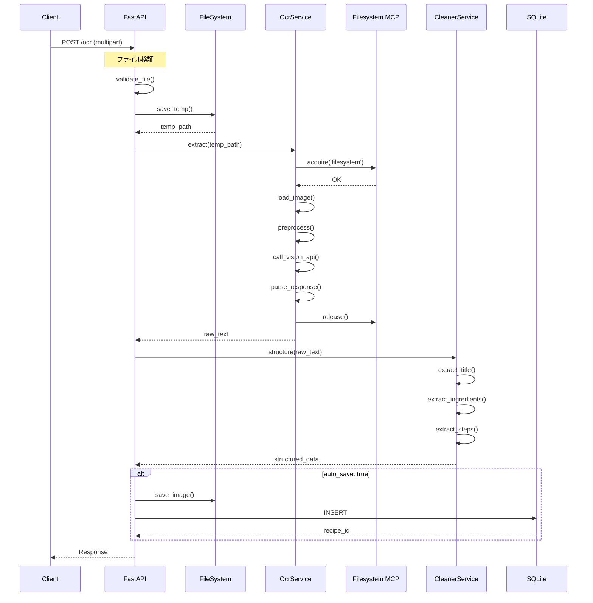

# OCR API (OCR API)

## 1. 概要

画像からレシピ情報を抽出する API エンドポイントの詳細仕様。

## 2. エンドポイント詳細

### 2.1 OCRレシピ抽出

**POST /api/v1/ocr**

画像ファイルからレシピ情報を抽出し、構造化データに変換する。

#### リクエスト

**Content-Type:** `multipart/form-data`

| フィールド | 型 | 必須 | 説明 |
|-----------|-----|------|------|
| image | file | Yes | 画像ファイル |
| options | json | No | オプション設定 |

**オプション**
```json
{
  "auto_save": true,
  "language_hint": "ja",
  "tag_ids": [1, 2]
}
```

#### cURL例

```bash
curl -X POST "http://localhost:8001/api/v1/ocr" \
  -F "image=@recipe.jpg" \
  -F 'options={"auto_save": true}'
```

#### レスポンス

**201 Created** (auto_save: true)
```json
{
  "status": "ok",
  "data": {
    "id": 1,
    "title": "カレーライス",
    "description": "画像から抽出されたレシピ",
    "servings": 4,
    "prep_time_minutes": null,
    "cook_time_minutes": null,
    "ingredients": [
      {
        "name": "たまねぎ",
        "name_normalized": "たまねぎ",
        "amount": 2,
        "unit": "個"
      },
      {
        "name": "にんじん",
        "name_normalized": "にんじん",
        "amount": 1,
        "unit": "本"
      }
    ],
    "steps": [
      {
        "step_number": 1,
        "description": "野菜を切る"
      }
    ],
    "image_path": "/images/ocr/recipe_001.jpg",
    "created_at": "2024-12-11T10:00:00Z"
  },
  "meta": {
    "ocr_engine": "claude-vision",
    "confidence": 0.92,
    "processing_time_ms": 3500,
    "detected_language": "ja"
  }
}
```

**200 OK** (auto_save: false)
```json
{
  "status": "ok",
  "data": {
    "title": "カレーライス",
    "raw_text": "カレーライス\n材料（4人分）\nたまねぎ 2個\nにんじん 1本\n...",
    "ingredients": [...],
    "steps": [...]
  },
  "meta": {
    "preview": true
  }
}
```

**400 Bad Request**
```json
{
  "status": "error",
  "data": null,
  "error": {
    "code": "INVALID_FILE",
    "message": "対応していないファイル形式です"
  }
}
```

**422 Unprocessable Entity**
```json
{
  "status": "error",
  "data": null,
  "error": {
    "code": "OCR_FAILED",
    "message": "テキストの抽出に失敗しました",
    "details": {
      "reason": "LOW_QUALITY_IMAGE"
    }
  }
}
```

---

### 2.2 OCRプレビュー

**POST /api/v1/ocr/preview**

画像から抽出したテキストのプレビューを取得する（保存なし）。

#### リクエスト

**Content-Type:** `multipart/form-data`

| フィールド | 型 | 必須 | 説明 |
|-----------|-----|------|------|
| image | file | Yes | 画像ファイル |

#### レスポンス

**200 OK**
```json
{
  "status": "ok",
  "data": {
    "raw_text": "カレーライス\n\n材料（4人分）\n・たまねぎ 2個\n・にんじん 1本\n・じゃがいも 3個\n・豚肉 300g\n・カレールー 1箱\n\n作り方\n1. 野菜を一口大に切る\n2. 鍋で肉を炒める\n3. 野菜を加えて炒める\n4. 水を加えて煮込む\n5. カレールーを入れて完成",
    "detected_sections": {
      "title": "カレーライス",
      "servings": "4人分",
      "ingredients": [
        "たまねぎ 2個",
        "にんじん 1本",
        "じゃがいも 3個",
        "豚肉 300g",
        "カレールー 1箱"
      ],
      "steps": [
        "野菜を一口大に切る",
        "鍋で肉を炒める",
        "野菜を加えて炒める",
        "水を加えて煮込む",
        "カレールーを入れて完成"
      ]
    },
    "confidence": 0.88
  },
  "meta": {
    "image_size": "1920x1080",
    "detected_language": "ja"
  }
}
```

## 3. 対応画像形式

| 形式 | 拡張子 | MIME Type | 対応 |
|------|--------|-----------|------|
| JPEG | .jpg, .jpeg | image/jpeg | ○ |
| PNG | .png | image/png | ○ |
| WebP | .webp | image/webp | ○ |
| GIF | .gif | image/gif | ○ |
| HEIC | .heic | image/heic | △ |
| BMP | .bmp | image/bmp | ○ |

## 4. 画像要件

### 4.1 推奨仕様

| 項目 | 推奨値 |
|------|--------|
| 最小解像度 | 640x480 |
| 最大解像度 | 4096x4096 |
| 最大ファイルサイズ | 10MB |
| DPI | 150以上 |

### 4.2 品質ガイドライン

- テキストが鮮明に読める
- 十分な照明
- 歪みが少ない
- コントラストが適切

## 5. 処理フロー

### 5.1 OCRフロー



### 5.2 テキスト構造化

```
入力テキスト:
"カレーライス
材料（4人分）
たまねぎ 2個
にんじん 1本
..."

構造化後:
{
  "title": "カレーライス",
  "servings": 4,
  "ingredients": [
    {"name": "たまねぎ", "amount": 2, "unit": "個"},
    {"name": "にんじん", "amount": 1, "unit": "本"}
  ]
}
```

## 6. エラーハンドリング

| エラーコード | 説明 | 対処 |
|-------------|------|------|
| INVALID_FILE | ファイル形式が不正 | 対応形式を使用 |
| FILE_TOO_LARGE | ファイルサイズ超過 | 10MB以下に圧縮 |
| LOW_QUALITY_IMAGE | 画像品質が低い | 高品質な画像を使用 |
| NO_TEXT_DETECTED | テキストが検出されない | 鮮明な画像を使用 |
| PARSE_FAILED | 構造化に失敗 | 手動で編集 |

## 7. Vision API 設定

### 7.1 Claude Vision

```python
# OCR設定
OCR_CONFIG = {
    "model": "claude-3-sonnet-20240229",
    "max_tokens": 4096,
    "prompt": """
    この画像からレシピ情報を抽出してください。
    以下の形式でJSON出力してください：
    {
      "title": "レシピ名",
      "servings": 人数（数値）,
      "ingredients": [{"name": "材料名", "amount": 数量, "unit": "単位"}],
      "steps": [{"step_number": 番号, "description": "手順"}]
    }
    """
}
```

## 8. 改訂履歴

| 日付 | バージョン | 変更内容 |
|------|-----------|----------|
| 2024-12-11 | 1.0.0 | 初版作成 |
