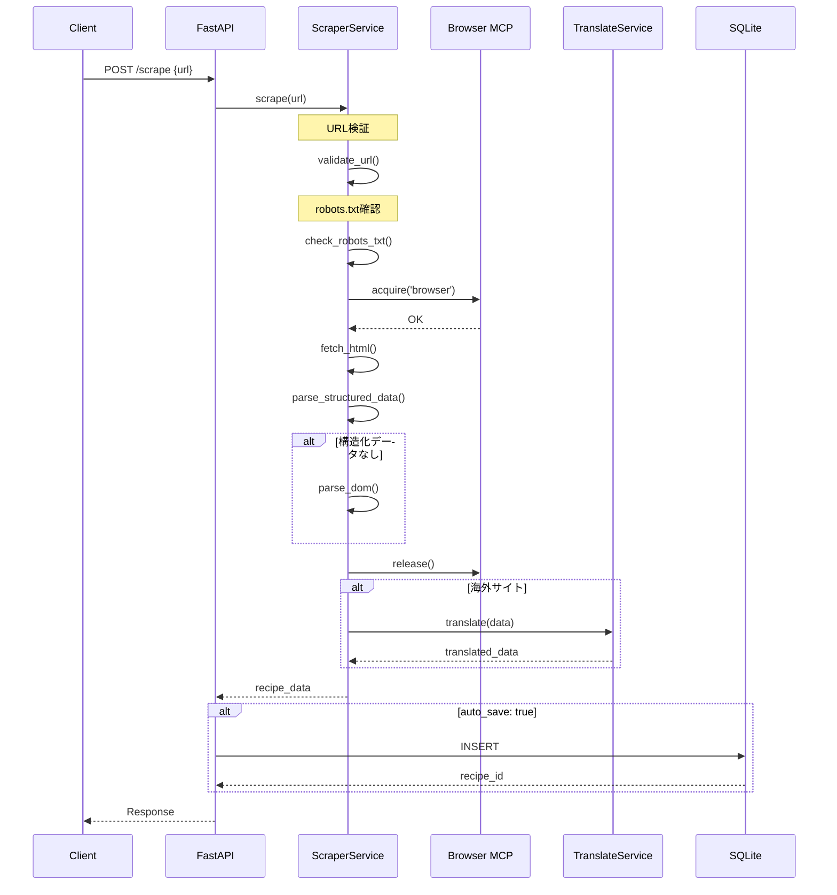

# スクレイピングAPI (Scraping API)

## 1. 概要

URLからレシピ情報を自動抽出する API エンドポイントの詳細仕様。

## 2. エンドポイント詳細

### 2.1 レシピスクレイピング

**POST /api/v1/scrape**

指定された URL からレシピ情報を抽出し、データベースに保存する。

#### リクエストボディ

```json
{
  "url": "https://cookpad.com/recipe/12345",
  "options": {
    "auto_translate": true,
    "auto_save": true,
    "tag_ids": [1, 2]
  }
}
```

**パラメータ**
| フィールド | 型 | 必須 | デフォルト | 説明 |
|-----------|-----|------|-----------|------|
| url | string | Yes | - | レシピページのURL |
| options.auto_translate | bool | No | true | 自動翻訳を行うか |
| options.auto_save | bool | No | true | 自動保存を行うか |
| options.tag_ids | array | No | [] | 自動付与するタグID |

#### レスポンス

**201 Created** (auto_save: true)
```json
{
  "status": "ok",
  "data": {
    "id": 1,
    "title": "Chicken Curry",
    "title_ja": "チキンカレー",
    "description": "A delicious homemade curry",
    "description_ja": "美味しい手作りカレー",
    "servings": 4,
    "prep_time_minutes": 15,
    "cook_time_minutes": 30,
    "source_url": "https://example.com/recipe/1",
    "source_site": "example.com",
    "ingredients": [
      {
        "name": "chicken",
        "name_ja": "鶏肉",
        "amount": 500,
        "unit": "g"
      }
    ],
    "steps": [
      {
        "step_number": 1,
        "description": "Cut the chicken",
        "description_ja": "鶏肉を切る"
      }
    ],
    "created_at": "2024-12-11T10:00:00Z"
  },
  "meta": {
    "scraped_at": "2024-12-11T10:00:00Z",
    "source_language": "en",
    "translated": true,
    "processing_time_ms": 2500
  }
}
```

**200 OK** (auto_save: false)
```json
{
  "status": "ok",
  "data": {
    "title": "Chicken Curry",
    "title_ja": "チキンカレー",
    ...
  },
  "meta": {
    "scraped_at": "2024-12-11T10:00:00Z",
    "preview": true
  }
}
```

**400 Bad Request**
```json
{
  "status": "error",
  "data": null,
  "error": {
    "code": "INVALID_URL",
    "message": "URLの形式が不正です"
  }
}
```

**422 Unprocessable Entity**
```json
{
  "status": "error",
  "data": null,
  "error": {
    "code": "SCRAPE_FAILED",
    "message": "レシピの抽出に失敗しました",
    "details": {
      "reason": "SITE_NOT_SUPPORTED",
      "url": "https://unknown-site.com/recipe"
    }
  }
}
```

---

### 2.2 対応サイト一覧

**GET /api/v1/scrape/supported**

スクレイピング対応サイトの一覧を取得する。

#### レスポンス

**200 OK**
```json
{
  "status": "ok",
  "data": {
    "sites": [
      {
        "name": "クックパッド",
        "domain": "cookpad.com",
        "country": "JP",
        "language": "ja",
        "features": ["structured_data", "dom_parsing"],
        "status": "active"
      },
      {
        "name": "クラシル",
        "domain": "kurashiru.com",
        "country": "JP",
        "language": "ja",
        "features": ["structured_data"],
        "status": "active"
      },
      {
        "name": "Allrecipes",
        "domain": "allrecipes.com",
        "country": "US",
        "language": "en",
        "features": ["structured_data", "dom_parsing"],
        "status": "active"
      },
      {
        "name": "BBC Good Food",
        "domain": "bbcgoodfood.com",
        "country": "UK",
        "language": "en",
        "features": ["structured_data"],
        "status": "active"
      },
      {
        "name": "Nadia",
        "domain": "oceans-nadia.com",
        "country": "JP",
        "language": "ja",
        "features": ["dom_parsing"],
        "status": "beta"
      },
      {
        "name": "デリッシュキッチン",
        "domain": "delishkitchen.tv",
        "country": "JP",
        "language": "ja",
        "features": ["dom_parsing"],
        "status": "beta"
      }
    ],
    "total": 6
  }
}
```

## 3. 処理フロー

### 3.1 スクレイピングフロー



### 3.2 エラーハンドリング

| エラーコード | 説明 | 対処 |
|-------------|------|------|
| INVALID_URL | URLの形式が不正 | 正しいURLを入力 |
| SITE_NOT_SUPPORTED | 対応していないサイト | 対応サイトを使用 |
| ROBOTS_BLOCKED | robots.txtで禁止 | 手動入力を使用 |
| FETCH_FAILED | ページ取得失敗 | URLを確認 |
| PARSE_FAILED | 解析失敗 | サイト構造変更の可能性 |
| RATE_LIMITED | レート制限 | 時間をおいて再試行 |

## 4. サイト別パーサー設定

### 4.1 クックパッド (cookpad.com)

```json
{
  "domain": "cookpad.com",
  "selectors": {
    "title": "h1.recipe-title",
    "description": ".recipe-description",
    "servings": ".servings-value",
    "ingredients": ".ingredient-list li",
    "steps": ".step-list li"
  },
  "structured_data": {
    "type": "Recipe",
    "enabled": true
  }
}
```

### 4.2 Allrecipes (allrecipes.com)

```json
{
  "domain": "allrecipes.com",
  "selectors": {
    "title": "h1.article-heading",
    "description": ".recipe-summary p",
    "servings": ".recipe-servings",
    "ingredients": ".mntl-structured-ingredients__list li",
    "steps": ".recipe-instructions li"
  },
  "structured_data": {
    "type": "Recipe",
    "enabled": true
  }
}
```

## 5. 制限事項

### 5.1 リクエスト制限
- 同一サイトへの連続リクエスト間隔: **3秒以上**
- 1日あたりの最大リクエスト: **100件**

### 5.2 コンテンツ制限
- 画像のダウンロード: **行わない**（URLのみ保存）
- JavaScript 実行: **必要最小限**

### 5.3 法的制限
- robots.txt を必ず遵守
- 個人利用の範囲内

## 6. 改訂履歴

| 日付 | バージョン | 変更内容 |
|------|-----------|----------|
| 2024-12-11 | 1.0.0 | 初版作成 |
