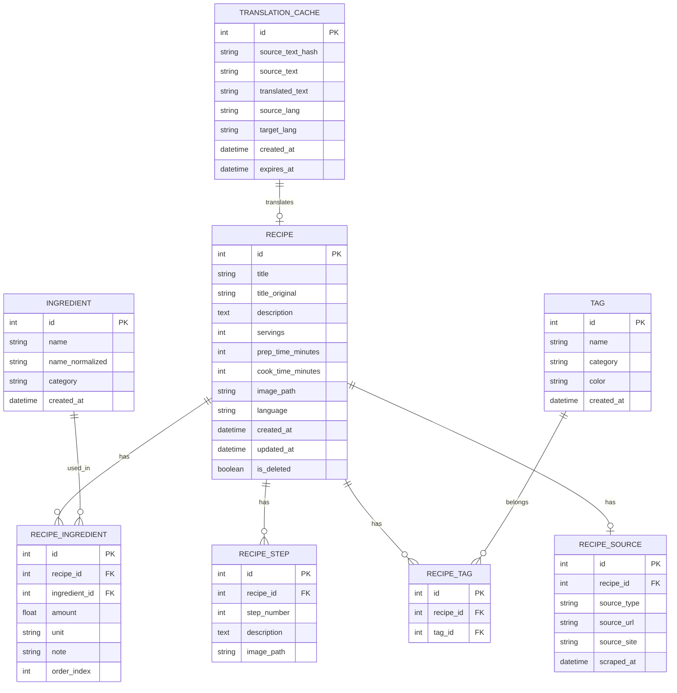

# ER図 (ER Diagram)

## 1. 概要

本ドキュメントは、Personal Recipe Intelligence (PRI) のデータベース構造を ER 図で表現する。

## 2. ER図（全体）



## 3. テーブル関連図

```
                    ┌──────────────────┐
                    │     RECIPE       │
                    │──────────────────│
                    │ id (PK)          │
                    │ title            │
                    │ description      │
                    │ servings         │
                    │ prep_time_minutes│
                    │ cook_time_minutes│
                    │ image_path       │
                    │ language         │
                    │ created_at       │
                    │ updated_at       │
                    │ is_deleted       │
                    └──────────────────┘
                           │ 1
                           │
         ┌─────────────────┼─────────────────┬─────────────────┐
         │                 │                 │                 │
         ▼ *               ▼ *               ▼ *               ▼ 0..1
┌─────────────────┐ ┌─────────────┐ ┌─────────────┐ ┌─────────────────┐
│RECIPE_INGREDIENT│ │ RECIPE_STEP │ │ RECIPE_TAG  │ │  RECIPE_SOURCE  │
│─────────────────│ │─────────────│ │─────────────│ │─────────────────│
│ id (PK)         │ │ id (PK)     │ │ id (PK)     │ │ id (PK)         │
│ recipe_id (FK)  │ │ recipe_id   │ │ recipe_id   │ │ recipe_id (FK)  │
│ ingredient_id   │ │ step_number │ │ tag_id (FK) │ │ source_type     │
│ amount          │ │ description │ └─────────────┘ │ source_url      │
│ unit            │ │ image_path  │        │        │ source_site     │
│ order_index     │ └─────────────┘        │        │ scraped_at      │
└─────────────────┘                        │        └─────────────────┘
         │ *                               │ *
         │                                 │
         ▼ 1                               ▼ 1
┌─────────────────┐                 ┌─────────────┐
│   INGREDIENT    │                 │     TAG     │
│─────────────────│                 │─────────────│
│ id (PK)         │                 │ id (PK)     │
│ name            │                 │ name        │
│ name_normalized │                 │ category    │
│ category        │                 │ color       │
│ created_at      │                 │ created_at  │
└─────────────────┘                 └─────────────┘
```

## 4. カーディナリティ

| 関係 | カーディナリティ | 説明 |
|------|-----------------|------|
| RECIPE - RECIPE_INGREDIENT | 1:N | 1レシピに複数の材料 |
| RECIPE - RECIPE_STEP | 1:N | 1レシピに複数の手順 |
| RECIPE - RECIPE_TAG | 1:N | 1レシピに複数のタグ |
| RECIPE - RECIPE_SOURCE | 1:0..1 | 1レシピに0または1つのソース |
| INGREDIENT - RECIPE_INGREDIENT | 1:N | 1材料が複数レシピで使用 |
| TAG - RECIPE_TAG | 1:N | 1タグが複数レシピに付与 |

## 5. インデックス設計

```sql
-- RECIPE テーブル
CREATE INDEX idx_recipe_title ON recipe(title);
CREATE INDEX idx_recipe_created_at ON recipe(created_at);
CREATE INDEX idx_recipe_is_deleted ON recipe(is_deleted);

-- INGREDIENT テーブル
CREATE UNIQUE INDEX idx_ingredient_name ON ingredient(name_normalized);

-- TAG テーブル
CREATE UNIQUE INDEX idx_tag_name ON tag(name);

-- RECIPE_INGREDIENT テーブル
CREATE INDEX idx_recipe_ingredient_recipe ON recipe_ingredient(recipe_id);
CREATE INDEX idx_recipe_ingredient_ingredient ON recipe_ingredient(ingredient_id);

-- RECIPE_TAG テーブル
CREATE INDEX idx_recipe_tag_recipe ON recipe_tag(recipe_id);
CREATE INDEX idx_recipe_tag_tag ON recipe_tag(tag_id);

-- TRANSLATION_CACHE テーブル
CREATE UNIQUE INDEX idx_translation_hash ON translation_cache(source_text_hash);
```

## 6. 改訂履歴

| 日付 | バージョン | 変更内容 |
|------|-----------|----------|
| 2024-12-11 | 1.0.0 | 初版作成 |
