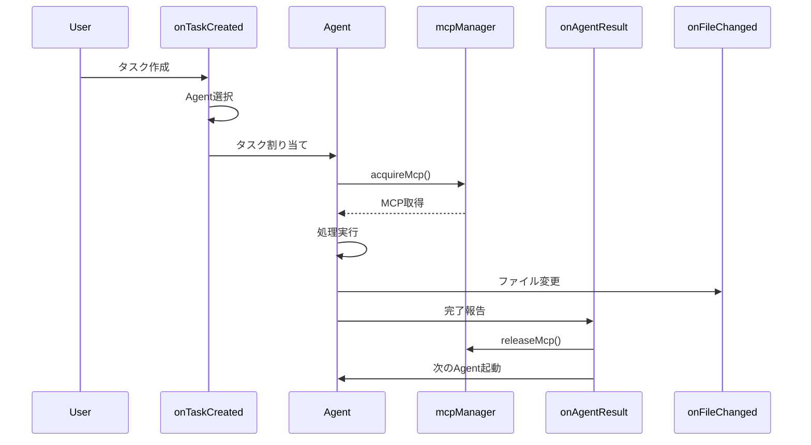

# Hooks設定 (Hooks Configuration)

## 1. 概要

本ドキュメントは、Personal Recipe Intelligence (PRI) の ClaudeCode Hooks 設定を定義する。

## 2. Hooks一覧

| Hook | トリガー | 説明 |
|------|---------|------|
| onTaskCreated | タスク作成時 | タスクを適切なAgentにルーティング |
| onFileChanged | ファイル変更時 | 変更を検知して関連処理を実行 |
| onAgentResult | Agent完了時 | 結果を受け取り次のAgentに連携 |
| onMcpEvent | MCP操作時 | MCP同時起動数を制御 |
| mcpManager | MCP管理 | MCPリソースの排他制御 |

## 3. Hook詳細

### 3.1 MCP Manager

```javascript
// .claude/hooks/mcp-manager.js

const mcpState = {
  activeMcp: null,
  queue: [],
  maxConcurrency: 1
};

/**
 * MCP取得リクエスト
 * @param {string} mcpType - 'browser' | 'puppeteer' | 'filesystem'
 * @param {string} requesterId - リクエスト元Agent ID
 */
async function acquireMcp(mcpType, requesterId) {
  // 排他制御: browser と puppeteer は同時起動禁止
  const exclusiveTypes = ['browser', 'puppeteer'];

  if (mcpState.activeMcp) {
    if (exclusiveTypes.includes(mcpType) && exclusiveTypes.includes(mcpState.activeMcp.type)) {
      // キューに追加
      return new Promise((resolve) => {
        mcpState.queue.push({ mcpType, requesterId, resolve });
      });
    }
  }

  // MCPを取得
  mcpState.activeMcp = { type: mcpType, owner: requesterId };
  return { success: true, mcpType };
}

/**
 * MCP解放
 * @param {string} requesterId - リクエスト元Agent ID
 */
async function releaseMcp(requesterId) {
  if (mcpState.activeMcp?.owner === requesterId) {
    mcpState.activeMcp = null;

    // キューから次を処理
    if (mcpState.queue.length > 0) {
      const next = mcpState.queue.shift();
      next.resolve(await acquireMcp(next.mcpType, next.requesterId));
    }
  }
}

module.exports = { acquireMcp, releaseMcp, mcpState };
```

### 3.2 onTaskCreated

```javascript
// .claude/hooks/on-task-created.js

const agents = require('../agents');

/**
 * タスク作成時のフック
 * @param {Object} task - 作成されたタスク
 */
async function onTaskCreated(task) {
  console.log(`[Hook] Task created: ${task.id}`);

  // タスク種別に応じてAgentを選択
  const agent = selectAgent(task);

  if (agent) {
    console.log(`[Hook] Routing to agent: ${agent.name}`);
    await dispatchToAgent(agent, task);
  } else {
    console.log(`[Hook] No suitable agent found, using Planner`);
    await dispatchToAgent(agents.planner, task);
  }
}

function selectAgent(task) {
  const taskType = task.type || detectTaskType(task.description);

  const agentMap = {
    'backend': agents.devapi,
    'frontend': agents.devui,
    'scrape': agents.scraper,
    'ocr': agents.ocr,
    'translate': agents.translation,
    'clean': agents.cleaner,
    'test': agents.qa,
    'doc': agents.writer
  };

  return agentMap[taskType];
}

function detectTaskType(description) {
  const keywords = {
    'api': 'backend',
    'エンドポイント': 'backend',
    'コンポーネント': 'frontend',
    'UI': 'frontend',
    'スクレイピング': 'scrape',
    'URL': 'scrape',
    'OCR': 'ocr',
    '画像': 'ocr',
    '翻訳': 'translate',
    '正規化': 'clean',
    'テスト': 'test',
    'ドキュメント': 'doc'
  };

  for (const [keyword, type] of Object.entries(keywords)) {
    if (description.includes(keyword)) {
      return type;
    }
  }

  return null;
}

module.exports = { onTaskCreated };
```

### 3.3 onFileChanged

```javascript
// .claude/hooks/on-file-changed.js

/**
 * ファイル変更時のフック
 * @param {Object} event - ファイル変更イベント
 */
async function onFileChanged(event) {
  const { path, type } = event;
  console.log(`[Hook] File ${type}: ${path}`);

  // ファイル種別に応じた処理
  if (path.endsWith('.py')) {
    await handlePythonFile(path, type);
  } else if (path.endsWith('.svelte') || path.endsWith('.js')) {
    await handleFrontendFile(path, type);
  } else if (path.endsWith('.md')) {
    await handleDocFile(path, type);
  }
}

async function handlePythonFile(path, type) {
  if (type === 'created' || type === 'modified') {
    // lint チェック
    console.log(`[Hook] Running lint on ${path}`);
    // await runLint(path);

    // テストファイルなら実行
    if (path.includes('/tests/')) {
      console.log(`[Hook] Running test: ${path}`);
      // await runTest(path);
    }
  }
}

async function handleFrontendFile(path, type) {
  if (type === 'created' || type === 'modified') {
    console.log(`[Hook] Frontend file changed: ${path}`);
    // Hot reload は Vite が自動で行う
  }
}

async function handleDocFile(path, type) {
  console.log(`[Hook] Documentation updated: ${path}`);
}

module.exports = { onFileChanged };
```

### 3.4 onAgentResult

```javascript
// .claude/hooks/on-agent-result.js

const { releaseMcp } = require('./mcp-manager');

/**
 * Agent完了時のフック
 * @param {Object} result - Agent実行結果
 */
async function onAgentResult(result) {
  const { agentId, agentName, status, output, mcpUsed } = result;

  console.log(`[Hook] Agent ${agentName} completed with status: ${status}`);

  // MCP解放
  if (mcpUsed) {
    await releaseMcp(agentId);
    console.log(`[Hook] Released MCP: ${mcpUsed}`);
  }

  // 成功時の後続処理
  if (status === 'success') {
    await handleSuccess(agentName, output);
  } else {
    await handleFailure(agentName, output);
  }
}

async function handleSuccess(agentName, output) {
  // Agent連携
  const nextAgents = {
    'Scraper': ['Translation', 'Cleaner'],
    'OCR': ['Translation', 'Cleaner'],
    'Translation': ['Cleaner'],
    'Cleaner': ['QA'],
    'DevAPI': ['QA'],
    'DevUI': ['QA'],
    'QA': ['Writer']
  };

  const next = nextAgents[agentName];
  if (next) {
    console.log(`[Hook] Triggering next agents: ${next.join(', ')}`);
    // 次のAgentをトリガー
  }
}

async function handleFailure(agentName, output) {
  console.error(`[Hook] Agent ${agentName} failed:`, output.error);
  // エラーログ記録
  // 必要に応じてリトライ
}

module.exports = { onAgentResult };
```

### 3.5 onMcpEvent

```javascript
// .claude/hooks/on-mcp-event.js

const { mcpState } = require('./mcp-manager');

/**
 * MCPイベントのフック
 * @param {Object} event - MCPイベント
 */
async function onMcpEvent(event) {
  const { type, mcpType, data } = event;

  console.log(`[Hook] MCP event: ${type} (${mcpType})`);

  switch (type) {
    case 'started':
      console.log(`[Hook] MCP ${mcpType} started`);
      break;

    case 'stopped':
      console.log(`[Hook] MCP ${mcpType} stopped`);
      break;

    case 'error':
      console.error(`[Hook] MCP ${mcpType} error:`, data.error);
      // MCP状態をリセット
      if (mcpState.activeMcp?.type === mcpType) {
        mcpState.activeMcp = null;
      }
      break;

    case 'timeout':
      console.warn(`[Hook] MCP ${mcpType} timeout`);
      // タイムアウト処理
      break;
  }
}

module.exports = { onMcpEvent };
```

## 4. Hooks連携図



## 5. 改訂履歴

| 日付 | バージョン | 変更内容 |
|------|-----------|----------|
| 2024-12-11 | 1.0.0 | 初版作成 |
