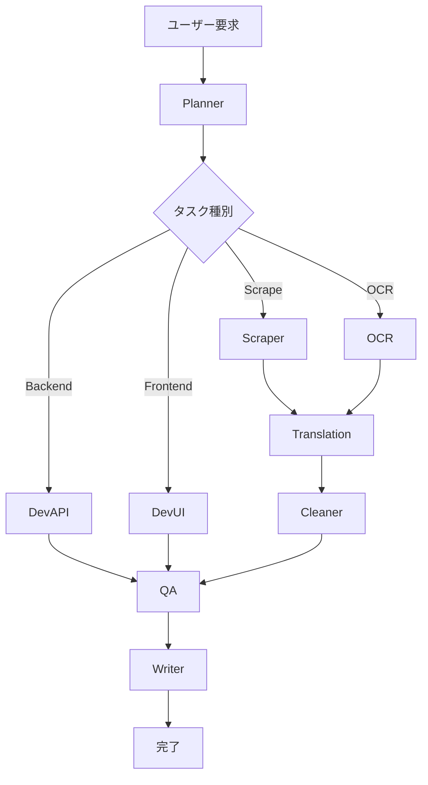

# SubAgents設定 (SubAgents Configuration)

## 1. 概要

本ドキュメントは、Personal Recipe Intelligence (PRI) の ClaudeCode SubAgents 設定を定義する。

## 2. SubAgents一覧

| Agent | 役割 | 優先度 |
|-------|------|--------|
| Planner | タスク計画・分割 | 高 |
| DevAPI | バックエンド開発 | 高 |
| DevUI | フロントエンド開発 | 高 |
| Scraper | スクレイピング機能 | 高 |
| OCR | OCR機能 | 高 |
| Translation | 翻訳機能 | 中 |
| Cleaner | データ正規化 | 中 |
| QA | テスト・品質 | 中 |
| Writer | ドキュメント | 低 |

## 3. Agent設定詳細

### 3.1 Planner

```json
{
  "name": "Planner",
  "role": "タスク計画・分割",
  "description": "ユーザーの要求を分析し、適切なサブタスクに分割してSubAgentsに割り当てる",
  "triggers": ["task:new", "task:complex"],
  "priority": 1,
  "capabilities": [
    "タスク分析",
    "優先度判定",
    "Agent選択",
    "進捗管理"
  ],
  "rules": [
    "タスクを最小単位に分割する",
    "依存関係を考慮する",
    "並列実行可能なタスクを識別する"
  ]
}
```

### 3.2 DevAPI

```json
{
  "name": "DevAPI",
  "role": "バックエンド開発",
  "description": "FastAPI、SQLModel、サービス層の実装を担当",
  "triggers": ["task:backend", "task:api"],
  "priority": 2,
  "capabilities": [
    "FastAPI ルート実装",
    "SQLModel モデル定義",
    "サービス層実装",
    "Pydantic スキーマ定義"
  ],
  "rules": [
    "CLAUDE.md のコーディング規約に従う",
    "型ヒントを必ず使用する",
    "テストを同時に作成する"
  ],
  "mcp_required": null
}
```

### 3.3 DevUI

```json
{
  "name": "DevUI",
  "role": "フロントエンド開発",
  "description": "Svelte コンポーネント、ページ、スタイルの実装を担当",
  "triggers": ["task:frontend", "task:ui"],
  "priority": 2,
  "capabilities": [
    "Svelte コンポーネント実装",
    "CSS スタイリング",
    "状態管理",
    "API 連携"
  ],
  "rules": [
    "デザインシステムに従う",
    "レスポンシブ対応",
    "アクセシビリティ考慮"
  ],
  "mcp_required": null
}
```

### 3.4 Scraper

```json
{
  "name": "Scraper",
  "role": "Webスクレイピング",
  "description": "レシピサイトからのデータ抽出を担当",
  "triggers": ["task:scrape", "url:recipe"],
  "priority": 2,
  "capabilities": [
    "HTML パース",
    "構造化データ抽出",
    "DOM 解析",
    "サイト別パーサー"
  ],
  "rules": [
    "robots.txt を遵守",
    "適切な間隔を空ける",
    "エラーハンドリング必須"
  ],
  "mcp_required": "browser"
}
```

### 3.5 OCR

```json
{
  "name": "OCR",
  "role": "画像テキスト抽出",
  "description": "画像からのレシピテキスト抽出を担当",
  "triggers": ["task:ocr", "file:image"],
  "priority": 2,
  "capabilities": [
    "画像読み込み",
    "Vision API 連携",
    "テキスト構造化"
  ],
  "rules": [
    "画像サイズ制限を確認",
    "対応形式を検証",
    "抽出結果を構造化"
  ],
  "mcp_required": "filesystem"
}
```

### 3.6 Translation

```json
{
  "name": "Translation",
  "role": "翻訳処理",
  "description": "海外レシピの日本語翻訳を担当",
  "triggers": ["task:translate", "lang:non-ja"],
  "priority": 3,
  "capabilities": [
    "言語検出",
    "DeepL API 連携",
    "キャッシュ管理",
    "単位変換"
  ],
  "rules": [
    "キャッシュを優先使用",
    "API 制限を考慮",
    "レート制限を遵守"
  ],
  "mcp_required": null
}
```

### 3.7 Cleaner

```json
{
  "name": "Cleaner",
  "role": "データ正規化",
  "description": "レシピデータの正規化・統一を担当",
  "triggers": ["task:clean", "data:raw"],
  "priority": 3,
  "capabilities": [
    "材料名正規化",
    "分量解析",
    "単位統一",
    "テキストクリーニング"
  ],
  "rules": [
    "正規化マスタを参照",
    "元データを保持",
    "変換ログを記録"
  ],
  "mcp_required": null
}
```

### 3.8 QA

```json
{
  "name": "QA",
  "role": "テスト・品質保証",
  "description": "テスト作成・実行・品質確認を担当",
  "triggers": ["task:test", "code:new"],
  "priority": 3,
  "capabilities": [
    "テストケース作成",
    "pytest 実行",
    "カバレッジ確認",
    "コードレビュー"
  ],
  "rules": [
    "カバレッジ 60% 以上",
    "エッジケースを含む",
    "モック使用推奨"
  ],
  "mcp_required": null
}
```

### 3.9 Writer

```json
{
  "name": "Writer",
  "role": "ドキュメント作成",
  "description": "ドキュメント・コメントの作成を担当",
  "triggers": ["task:doc", "code:complete"],
  "priority": 4,
  "capabilities": [
    "README 作成",
    "API ドキュメント",
    "コードコメント",
    "CHANGELOG 更新"
  ],
  "rules": [
    "日本語で記述",
    "Markdown 形式",
    "具体例を含む"
  ],
  "mcp_required": null
}
```

## 4. MCP連携

### 4.1 MCP制御ルール

```javascript
// MCP同時起動数: 最大1
const MCP_CONFIG = {
  maxConcurrency: 1,
  types: ['browser', 'puppeteer', 'filesystem'],
  exclusiveTypes: ['browser', 'puppeteer']  // 同時起動禁止
};
```

### 4.2 MCP優先順位

| Agent | 必要MCP | 優先度 |
|-------|---------|--------|
| Scraper | browser | 1 |
| OCR | filesystem | 2 |

## 5. タスクフロー



## 6. 改訂履歴

| 日付 | バージョン | 変更内容 |
|------|-----------|----------|
| 2024-12-11 | 1.0.0 | 初版作成 |
