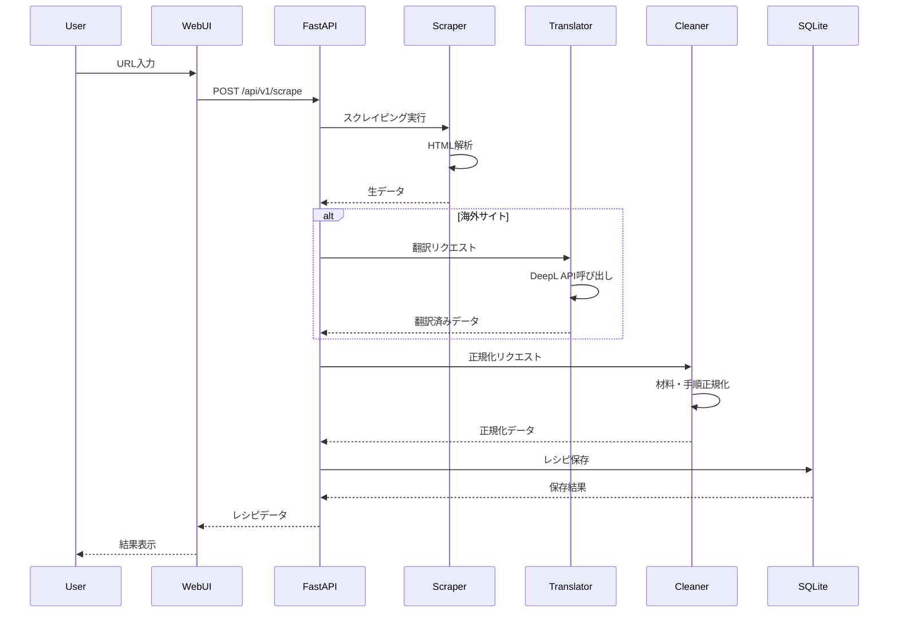
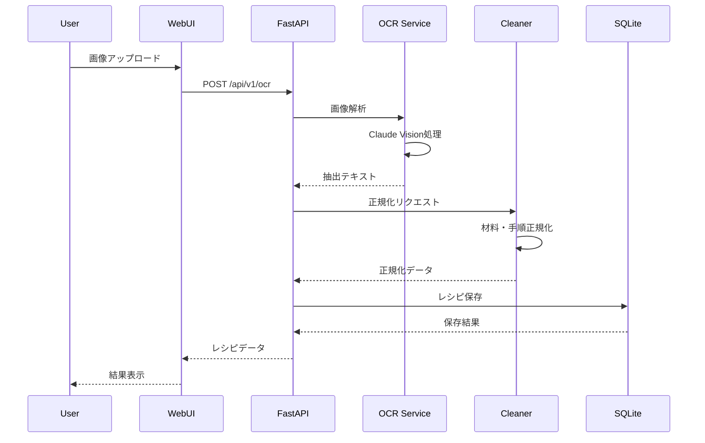
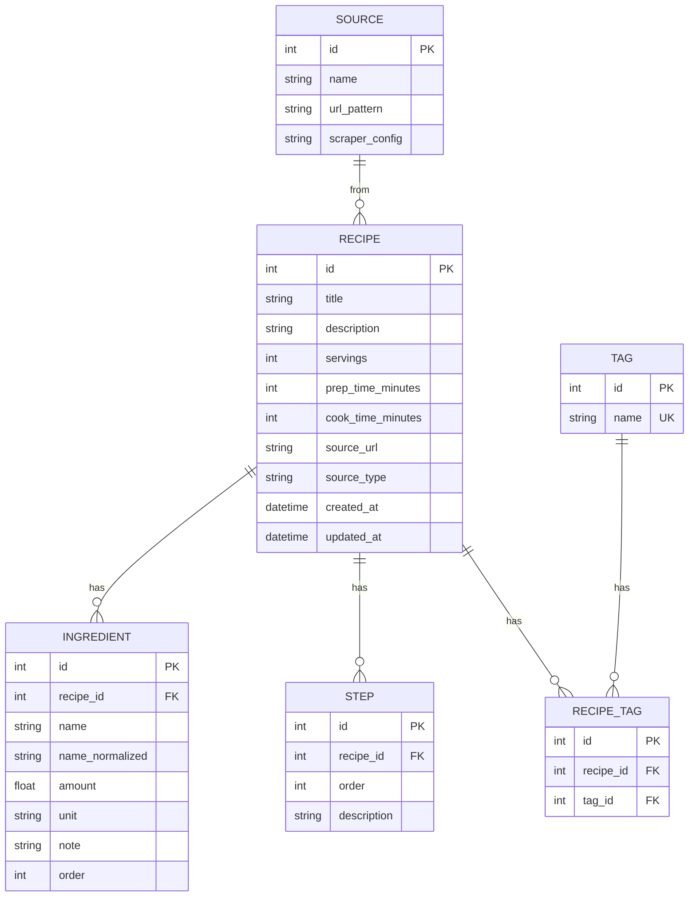

# Personal Recipe Intelligence - システムアーキテクチャ

## 概要

Personal Recipe Intelligence (PRI) は、レシピ収集・管理のための個人向けシステムです。
本ドキュメントはシステム全体のアーキテクチャを定義します。

---

## システム構成図

```
┌─────────────────────────────────────────────────────────────────┐
│                        User Interface                           │
│  ┌──────────────────────────────────────────────────────────┐  │
│  │                   Svelte WebUI                            │  │
│  │  ┌────────┐ ┌────────┐ ┌────────┐ ┌────────┐            │  │
│  │  │ Recipe │ │ Search │ │  Tag   │ │ Import │            │  │
│  │  │  List  │ │  View  │ │Manager │ │  View  │            │  │
│  │  └────────┘ └────────┘ └────────┘ └────────┘            │  │
│  └──────────────────────────────────────────────────────────┘  │
└─────────────────────────────────────────────────────────────────┘
                              │
                              ▼
┌─────────────────────────────────────────────────────────────────┐
│                         API Layer                                │
│  ┌──────────────────────────────────────────────────────────┐  │
│  │                    FastAPI Server                         │  │
│  │  ┌────────┐ ┌────────┐ ┌────────┐ ┌────────┐            │  │
│  │  │/recipes│ │/scrape │ │  /ocr  │ │ /tags  │            │  │
│  │  └────────┘ └────────┘ └────────┘ └────────┘            │  │
│  └──────────────────────────────────────────────────────────┘  │
└─────────────────────────────────────────────────────────────────┘
                              │
                              ▼
┌─────────────────────────────────────────────────────────────────┐
│                       Service Layer                              │
│  ┌──────────┐ ┌──────────┐ ┌──────────┐ ┌──────────┐          │
│  │ Scraper  │ │   OCR    │ │Translator│ │ Cleaner  │          │
│  │ Service  │ │ Service  │ │ Service  │ │ Service  │          │
│  └──────────┘ └──────────┘ └──────────┘ └──────────┘          │
└─────────────────────────────────────────────────────────────────┘
                              │
                              ▼
┌─────────────────────────────────────────────────────────────────┐
│                        Data Layer                                │
│  ┌──────────────────────────────────────────────────────────┐  │
│  │                      SQLite DB                            │  │
│  │  ┌────────┐ ┌────────┐ ┌────────┐ ┌────────┐            │  │
│  │  │recipes │ │ingredi-│ │ steps  │ │  tags  │            │  │
│  │  │        │ │  ents  │ │        │ │        │            │  │
│  │  └────────┘ └────────┘ └────────┘ └────────┘            │  │
│  └──────────────────────────────────────────────────────────┘  │
└─────────────────────────────────────────────────────────────────┘
```

---

## コンポーネント詳細

### Frontend (Svelte)

```
frontend/
├── src/
│   ├── App.svelte          # メインアプリケーション
│   ├── components/         # 共通コンポーネント
│   │   ├── RecipeCard.svelte
│   │   ├── RecipeList.svelte
│   │   ├── SearchBar.svelte
│   │   └── TagFilter.svelte
│   ├── pages/              # ページコンポーネント
│   │   ├── Home.svelte
│   │   ├── RecipeDetail.svelte
│   │   └── Import.svelte
│   ├── stores/             # 状態管理
│   │   └── recipes.js
│   └── lib/                # ユーティリティ
│       └── api.js
└── tests/
```

### Backend (FastAPI)

```
backend/
├── api/
│   ├── main.py             # FastAPIアプリケーション
│   ├── routes/             # ルート定義
│   │   ├── recipes.py
│   │   ├── scrape.py
│   │   ├── ocr.py
│   │   └── tags.py
│   └── dependencies.py     # 依存性注入
├── models/
│   ├── recipe.py           # データモデル
│   └── schemas.py          # Pydanticスキーマ
├── services/
│   ├── recipe_service.py   # レシピ操作
│   └── search_service.py   # 検索機能
├── scraper/
│   ├── base.py             # 基底クラス
│   ├── cookpad.py          # クックパッド用
│   └── allrecipes.py       # Allrecipes用
├── ocr/
│   └── extractor.py        # OCR処理
├── translation/
│   └── deepl.py            # DeepL連携
└── tests/
```

---

## データフロー

### レシピ取得フロー（Webスクレイピング）



### レシピ取得フロー（OCR）



---

## データベース設計

### ER図



---

## SubAgents アーキテクチャ

### エージェント構成

```
┌─────────────────────────────────────────────────────────────────┐
│                      PlannerAgent                               │
│                    (タスク分解・割当)                            │
└─────────────────────────────────────────────────────────────────┘
                              │
        ┌─────────────────────┼─────────────────────┐
        ▼                     ▼                     ▼
┌──────────────┐     ┌──────────────┐     ┌──────────────┐
│ ScraperAgent │     │   OcrAgent   │     │  DevAPI/UI   │
│  (MCP使用)   │     │  (MCP使用)   │     │   Agent      │
└──────────────┘     └──────────────┘     └──────────────┘
        │                     │
        └──────────┬──────────┘
                   ▼
         ┌──────────────┐
         │Translation   │
         │   Agent      │
         └──────────────┘
                   │
                   ▼
         ┌──────────────┐
         │  Cleaner     │
         │   Agent      │
         └──────────────┘
                   │
        ┌──────────┴──────────┐
        ▼                     ▼
┌──────────────┐     ┌──────────────┐
│   QaAgent    │     │ WriterAgent  │
└──────────────┘     └──────────────┘
```

### MCP制御

```
┌─────────────────────────────────────────────────────────────────┐
│                       MCP Manager                               │
│  ┌──────────────────────────────────────────────────────────┐  │
│  │  Browser MCP ──X── Puppeteer MCP (同時起動禁止)          │  │
│  │       │                   │                               │  │
│  │       └───────┬───────────┘                               │  │
│  │               │                                           │  │
│  │       Filesystem MCP                                      │  │
│  │                                                           │  │
│  │  Max Concurrent: 1                                        │  │
│  └──────────────────────────────────────────────────────────┘  │
└─────────────────────────────────────────────────────────────────┘
```

---

## セキュリティアーキテクチャ

### 認証・認可

```
┌─────────────────────────────────────────────────────────────────┐
│                      Security Layer                             │
│  ┌──────────────────────────────────────────────────────────┐  │
│  │  API Key Authentication                                   │  │
│  │  - Header: X-API-Key                                      │  │
│  │  - 個人利用のためシンプルな認証                           │  │
│  └──────────────────────────────────────────────────────────┘  │
│                                                                 │
│  ┌──────────────────────────────────────────────────────────┐  │
│  │  Input Validation (Pydantic)                              │  │
│  │  - 全APIエンドポイントでバリデーション                    │  │
│  │  - SQLインジェクション対策                                │  │
│  └──────────────────────────────────────────────────────────┘  │
│                                                                 │
│  ┌──────────────────────────────────────────────────────────┐  │
│  │  Logging & Audit                                          │  │
│  │  - 機密データのマスキング                                 │  │
│  │  - 操作ログの記録                                         │  │
│  └──────────────────────────────────────────────────────────┘  │
└─────────────────────────────────────────────────────────────────┘
```

---

## 技術スタック

| レイヤー | 技術 | バージョン |
|---------|------|-----------|
| Frontend | Svelte | 4.x |
| Build Tool | Vite + Bun | 5.x |
| Backend | FastAPI | 0.104+ |
| ORM | SQLModel | 0.0.14+ |
| Database | SQLite | 3.x |
| Migration | Alembic | 1.13+ |
| Testing | pytest / bun test | - |
| Linting | Ruff / ESLint | - |
| Formatting | Black / Prettier | - |

---

## デプロイメント

### ローカル開発環境

```bash
# 起動コマンド
./scripts/dev.sh

# 構成
# - Backend: http://127.0.0.1:8000
# - Frontend: http://127.0.0.1:5173
# - Database: data/db/recipes.db
```

### 本番環境（将来）

- Docker コンテナ化
- リバースプロキシ（Nginx）
- HTTPS対応

---

## 改訂履歴

| 日付 | バージョン | 変更内容 |
|------|-----------|----------|
| 2024-12-11 | 1.0.0 | 初版作成 |
