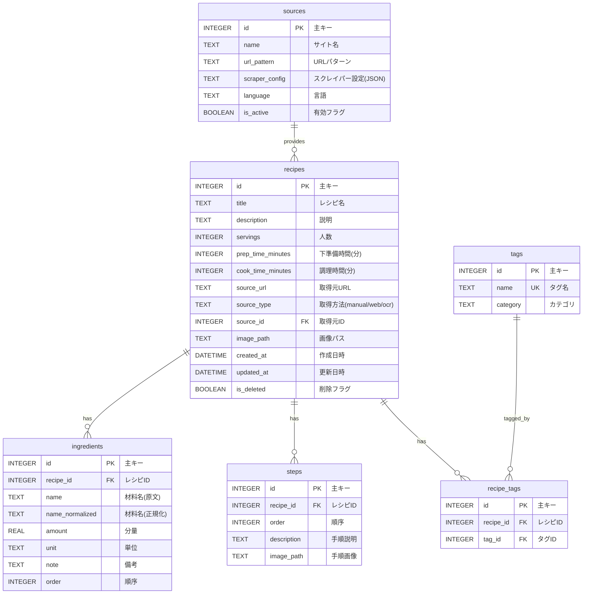

# Personal Recipe Intelligence - ER図

## データベーススキーマ



---

## テーブル詳細

### recipes（レシピ）

| カラム名 | 型 | 制約 | 説明 |
|---------|-----|------|------|
| id | INTEGER | PK, AUTO | 主キー |
| title | TEXT | NOT NULL | レシピ名 |
| description | TEXT | | 説明・概要 |
| servings | INTEGER | | 何人分 |
| prep_time_minutes | INTEGER | | 下準備時間（分） |
| cook_time_minutes | INTEGER | | 調理時間（分） |
| source_url | TEXT | | 取得元URL |
| source_type | TEXT | DEFAULT 'manual' | 取得方法（manual/web/ocr） |
| source_id | INTEGER | FK | 取得元マスタID |
| image_path | TEXT | | メイン画像パス |
| created_at | DATETIME | DEFAULT NOW | 作成日時 |
| updated_at | DATETIME | DEFAULT NOW | 更新日時 |
| is_deleted | BOOLEAN | DEFAULT FALSE | 論理削除フラグ |

**インデックス:**
- `idx_recipes_title` ON title
- `idx_recipes_source_type` ON source_type
- `idx_recipes_created_at` ON created_at

---

### ingredients（材料）

| カラム名 | 型 | 制約 | 説明 |
|---------|-----|------|------|
| id | INTEGER | PK, AUTO | 主キー |
| recipe_id | INTEGER | FK, NOT NULL | レシピID |
| name | TEXT | NOT NULL | 材料名（原文） |
| name_normalized | TEXT | NOT NULL | 材料名（正規化済み） |
| amount | REAL | | 分量（数値） |
| unit | TEXT | | 単位（g, ml, 個 等） |
| note | TEXT | | 備考（お好みで等） |
| order | INTEGER | DEFAULT 0 | 表示順序 |

**インデックス:**
- `idx_ingredients_recipe_id` ON recipe_id
- `idx_ingredients_name_normalized` ON name_normalized

---

### steps（調理手順）

| カラム名 | 型 | 制約 | 説明 |
|---------|-----|------|------|
| id | INTEGER | PK, AUTO | 主キー |
| recipe_id | INTEGER | FK, NOT NULL | レシピID |
| order | INTEGER | NOT NULL | 手順番号 |
| description | TEXT | NOT NULL | 手順説明 |
| image_path | TEXT | | 手順画像パス |

**インデックス:**
- `idx_steps_recipe_id` ON recipe_id

---

### tags（タグ）

| カラム名 | 型 | 制約 | 説明 |
|---------|-----|------|------|
| id | INTEGER | PK, AUTO | 主キー |
| name | TEXT | UNIQUE, NOT NULL | タグ名 |
| category | TEXT | | カテゴリ（料理/食材/季節 等） |

**インデックス:**
- `idx_tags_name` ON name (UNIQUE)
- `idx_tags_category` ON category

---

### recipe_tags（レシピ-タグ関連）

| カラム名 | 型 | 制約 | 説明 |
|---------|-----|------|------|
| id | INTEGER | PK, AUTO | 主キー |
| recipe_id | INTEGER | FK, NOT NULL | レシピID |
| tag_id | INTEGER | FK, NOT NULL | タグID |

**インデックス:**
- `idx_recipe_tags_recipe_id` ON recipe_id
- `idx_recipe_tags_tag_id` ON tag_id
- `uniq_recipe_tag` ON (recipe_id, tag_id) UNIQUE

---

### sources（取得元マスタ）

| カラム名 | 型 | 制約 | 説明 |
|---------|-----|------|------|
| id | INTEGER | PK, AUTO | 主キー |
| name | TEXT | NOT NULL | サイト名 |
| url_pattern | TEXT | | URLパターン（正規表現） |
| scraper_config | TEXT | | スクレイパー設定（JSON） |
| language | TEXT | DEFAULT 'ja' | 言語 |
| is_active | BOOLEAN | DEFAULT TRUE | 有効フラグ |

---

## リレーション

### 1対多

- `recipes` → `ingredients`: 1つのレシピに複数の材料
- `recipes` → `steps`: 1つのレシピに複数の手順
- `recipes` → `recipe_tags`: 1つのレシピに複数のタグ
- `sources` → `recipes`: 1つの取得元から複数のレシピ

### 多対多

- `recipes` ↔ `tags`: レシピとタグは多対多（`recipe_tags`経由）

---

## 初期データ

### tags（初期タグ）

```sql
INSERT INTO tags (name, category) VALUES
('和食', '料理'),
('洋食', '料理'),
('中華', '料理'),
('イタリアン', '料理'),
('肉料理', '食材'),
('魚料理', '食材'),
('野菜料理', '食材'),
('簡単', '難易度'),
('時短', '難易度'),
('本格', '難易度'),
('春', '季節'),
('夏', '季節'),
('秋', '季節'),
('冬', '季節');
```

### sources（初期取得元）

```sql
INSERT INTO sources (name, url_pattern, language) VALUES
('クックパッド', 'cookpad.com', 'ja'),
('クラシル', 'kurashiru.com', 'ja'),
('Nadia', 'oceans-nadia.com', 'ja'),
('Allrecipes', 'allrecipes.com', 'en'),
('BBC Good Food', 'bbcgoodfood.com', 'en'),
('手動入力', NULL, 'ja'),
('OCR', NULL, 'ja');
```

---

## 改訂履歴

| 日付 | バージョン | 変更内容 |
|------|-----------|----------|
| 2024-12-11 | 1.0.0 | 初版作成 |
