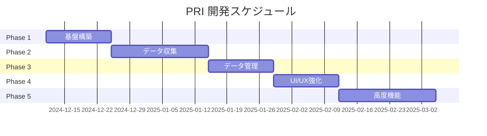

# Personal Recipe Intelligence - 開発フェーズ計画

## 概要

本ドキュメントは Personal Recipe Intelligence (PRI) プロジェクトの開発フェーズを定義します。
各フェーズは独立してリリース可能な単位として設計されています。

---

## フェーズ一覧

| フェーズ | 名称 | 目標 | 主要成果物 |
|---------|------|------|-----------|
| Phase 1 | 基盤構築 | 開発環境とコア機能の構築 | API基盤, DB設計, 基本UI |
| Phase 2 | データ収集 | レシピ収集機能の実装 | Scraper, OCR, 翻訳 |
| Phase 3 | データ管理 | レシピ管理機能の充実 | CRUD, 検索, タグ管理 |
| Phase 4 | UI/UX強化 | ユーザー体験の向上 | 高度なUI, レスポンシブ対応 |
| Phase 5 | 高度機能 | AI活用・自動化機能 | レコメンド, 自動分類 |

---

## Phase 1: 基盤構築

### 目標
- 開発環境の整備
- APIサーバーの基本構築
- データベース設計と実装
- 基本的なWebUIの構築

### タスク

#### 1.1 開発環境セットアップ
- [x] プロジェクト構造の作成
- [x] CLAUDE.md の作成
- [x] SubAgents 設定の作成
- [x] Hooks 設定の作成
- [ ] Python仮想環境の構築
- [ ] Node.js/Bun環境の構築

#### 1.2 バックエンド基盤
- [x] FastAPI プロジェクト初期化
- [x] SQLModel モデル定義
- [ ] Alembic マイグレーション設定
- [ ] 基本CRUD API実装
- [ ] Pydanticバリデーション実装

#### 1.3 フロントエンド基盤
- [x] Svelte プロジェクト初期化
- [x] 基本コンポーネント作成
- [ ] API通信レイヤー実装
- [ ] 状態管理実装

#### 1.4 データベース
- [x] ERD設計
- [ ] SQLite データベース作成
- [ ] 初期マイグレーション実行
- [ ] シードデータ作成

### 成果物
- 動作するAPIサーバー
- 基本的なWebUI
- データベーススキーマ

### 完了条件
- `/api/v1/recipes` エンドポイントが動作する
- レシピの登録・取得ができる
- WebUIでレシピ一覧が表示される

---

## Phase 2: データ収集

### 目標
- Webスクレイピング機能の実装
- OCR機能の実装
- 海外レシピの翻訳機能実装
- データ正規化パイプラインの構築

### タスク

#### 2.1 Webスクレイピング
- [ ] ScraperAgent の実装
- [ ] 国内サイト対応（クックパッド等）
- [ ] 海外サイト対応（Allrecipes等）
- [ ] DOM解析ロジック実装
- [ ] MCP連携実装

#### 2.2 OCR機能
- [ ] OcrAgent の実装
- [ ] 画像アップロードAPI
- [ ] Claude Vision 連携
- [ ] 手書きレシピ対応

#### 2.3 翻訳機能
- [ ] TranslationAgent の実装
- [ ] DeepL API 連携
- [ ] 分量変換（cup→ml等）

#### 2.4 データ正規化
- [ ] CleanerAgent の実装
- [ ] 材料名正規化ルール
- [ ] 分量パース処理
- [ ] 手順構造化処理

### 成果物
- URLからレシピを取得するAPI
- 画像からレシピを取得するAPI
- 正規化されたレシピデータ

### 完了条件
- URLを入力するとレシピが構造化データとして取得できる
- 画像をアップロードするとテキストが抽出できる
- 海外レシピが日本語化される

---

## Phase 3: データ管理

### 目標
- レシピCRUD機能の完成
- 高度な検索機能の実装
- タグ管理機能の実装
- データエクスポート機能

### タスク

#### 3.1 CRUD機能
- [ ] レシピ作成API完成
- [ ] レシピ更新API
- [ ] レシピ削除API（論理削除）
- [ ] バリデーション強化

#### 3.2 検索機能
- [ ] 全文検索実装
- [ ] タグ検索
- [ ] 材料検索
- [ ] 複合条件検索

#### 3.3 タグ管理
- [ ] タグCRUD API
- [ ] 自動タグ付け機能
- [ ] タグ階層構造

#### 3.4 データ管理
- [ ] エクスポート機能（JSON/CSV）
- [ ] インポート機能
- [ ] バックアップ機能

### 成果物
- 完全なCRUD API
- 検索機能付きUI
- タグ管理機能

### 完了条件
- レシピの追加・編集・削除ができる
- キーワードでレシピを検索できる
- タグでフィルタリングできる

---

## Phase 4: UI/UX強化

### 目標
- ユーザーインターフェースの改善
- レスポンシブデザイン対応
- パフォーマンス最適化

### タスク

#### 4.1 UI改善
- [ ] デザインシステム構築
- [ ] コンポーネントライブラリ
- [ ] アニメーション追加
- [ ] ダークモード対応

#### 4.2 レスポンシブ対応
- [ ] モバイル最適化
- [ ] タブレット対応
- [ ] PWA対応

#### 4.3 パフォーマンス
- [ ] 画像最適化
- [ ] 遅延読み込み
- [ ] キャッシュ戦略

#### 4.4 UX改善
- [ ] キーボードショートカット
- [ ] ドラッグ&ドロップ
- [ ] 一括操作

### 成果物
- 洗練されたUI
- モバイル対応
- 高速なレスポンス

### 完了条件
- すべてのデバイスで快適に操作できる
- ページ読み込みが200ms以下

---

## Phase 5: 高度機能

### 目標
- AI活用機能の実装
- 自動化機能の強化
- 分析機能の追加

### タスク

#### 5.1 レコメンド機能
- [ ] 類似レシピ推薦
- [ ] 材料ベース推薦
- [ ] 季節・イベント推薦

#### 5.2 自動分類
- [ ] カテゴリ自動判定
- [ ] 難易度自動判定
- [ ] 調理時間推定

#### 5.3 献立機能
- [ ] 週間献立生成
- [ ] 栄養バランス計算
- [ ] 買い物リスト生成

#### 5.4 分析機能
- [ ] 利用統計
- [ ] 料理傾向分析
- [ ] レシピ人気度

### 成果物
- レコメンドシステム
- 自動分類機能
- 献立生成機能

### 完了条件
- 関連レシピが自動で表示される
- 献立が自動生成される

---

## スケジュール目安

---

## 品質基準

### コード品質
- テストカバレッジ: 60%以上
- Lint エラー: 0
- 型チェック: パス

### パフォーマンス
- API応答時間: 200ms以下
- フロントエンド初期読み込み: 3秒以下

### セキュリティ
- 入力バリデーション: 全API
- 依存関係脆弱性: 0

---

## リスク管理

| リスク | 影響度 | 対策 |
|--------|--------|------|
| 外部API制限 | 高 | キャッシュ、レート制限対応 |
| スクレイピング禁止 | 中 | robots.txt遵守、手動入力対応 |
| データ量増大 | 中 | ページネーション、インデックス最適化 |

---

## 改訂履歴

| 日付 | バージョン | 変更内容 |
|------|-----------|----------|
| 2024-12-11 | 1.0.0 | 初版作成 |
